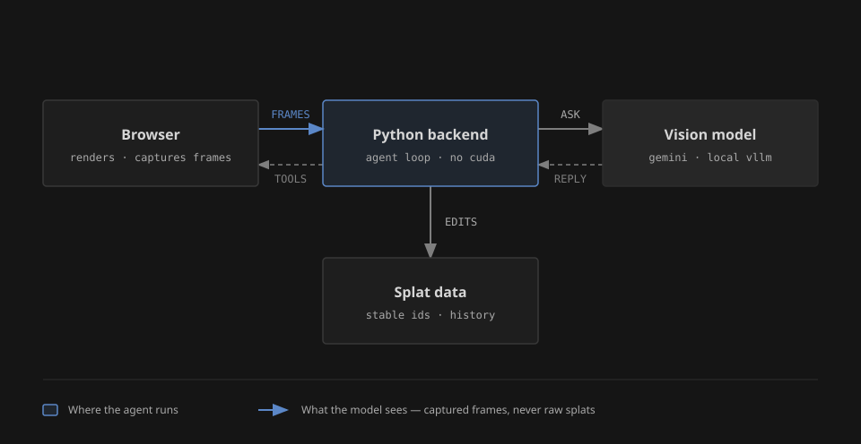
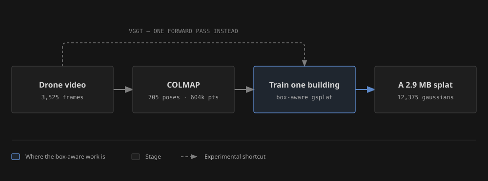
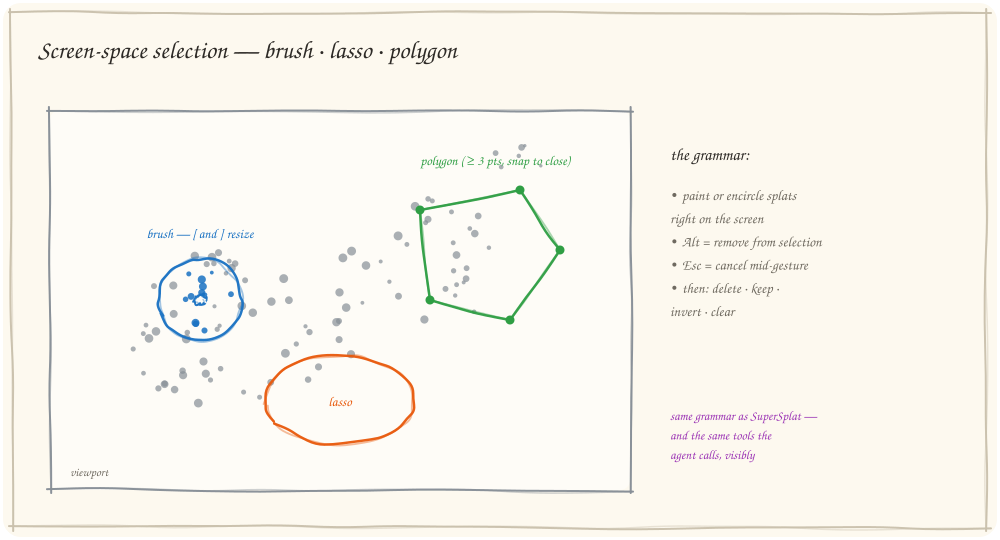
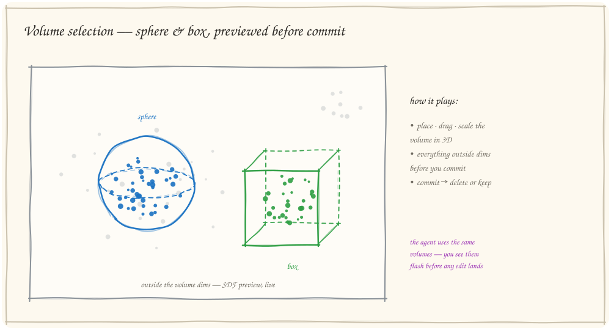
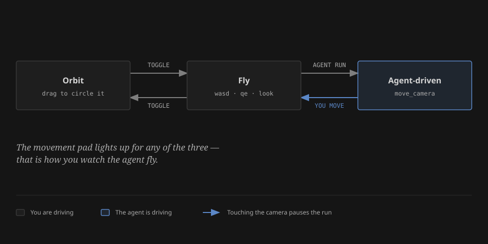
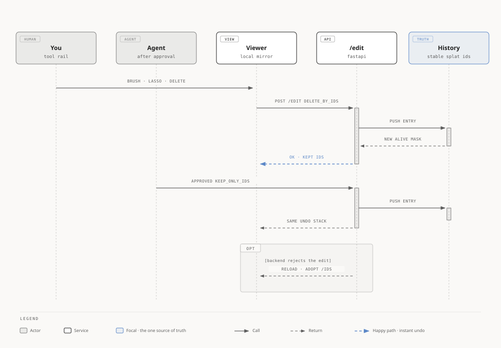
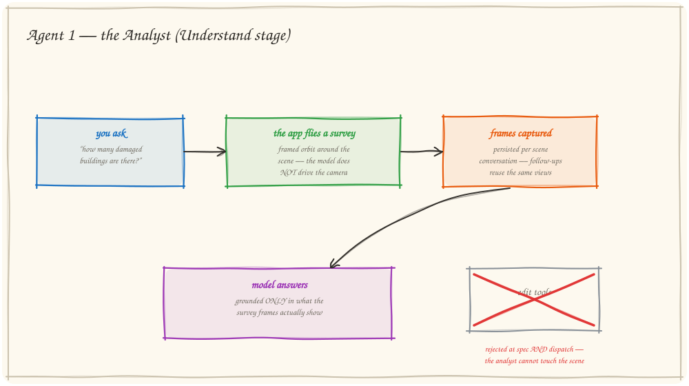
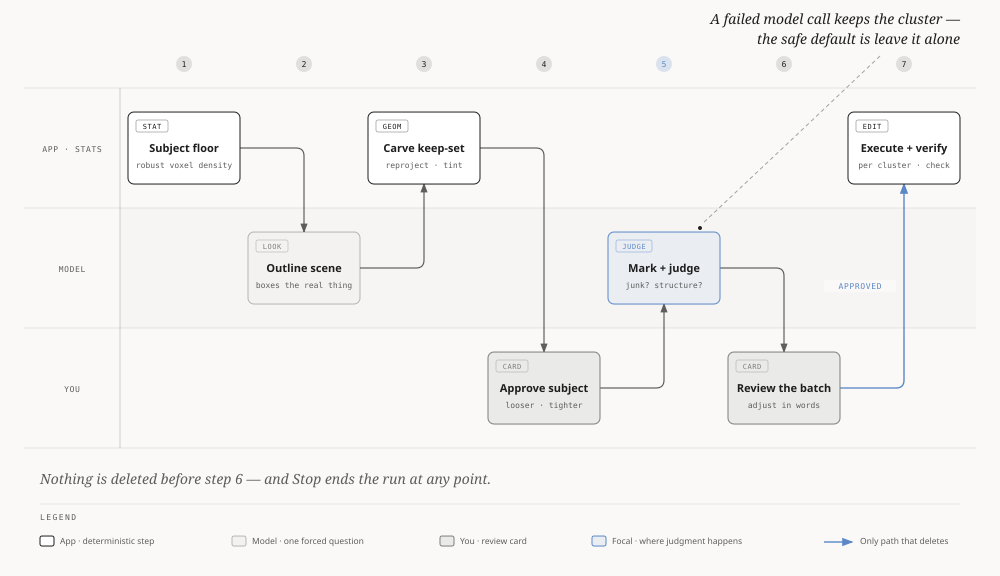

# SplatAgent (GeoSplat Inspector)

A local 3D Gaussian Splatting editor where an **AI agent works the same visible
tools a human does** — it flies the camera, selects splats, proposes edits, and
answers questions about the scene, all in front of you.

<p align="center">
  
</p>

- The **browser is both the renderer and the agent's eyes**: SparkJS draws the
  gaussians, and captured frames are what the vision model actually sees.
- A **CPU-only Python backend** (FastAPI) owns the splat data, metrics, edit
  history, and the agent loop — no CUDA anywhere in the app.
- **Model-agnostic**: Gemini by default, any OpenAI-compatible API, or a fully
  local vLLM/Ollama model ([details below](#model-backends)).

The scenes it operates on are real: post-Hurricane-Ian drone reconstructions.
The story below follows the demo order — how the splats were made, how the
editor works, and how the two agents work.

---

## How the demo scenes were made

The demo splats come from a companion pipeline repo
(`3DAeroRelief_Reconstruction`) that turns raw drone video of Hurricane Ian
relief sites (Iona Point, Sanibel Island) into compact, per-building Gaussian
splats. The frames have no GPS, so every reconstruction is scale-free — pure
geometry from pixels.

<p align="center">
  
</p>

Stage by stage:

1. **Thin the frames.** Score sharpness (variance of Laplacian), keep the
   sharpest frame per sliding window of 5 — 3,525 raw 4K frames become 705.
2. **COLMAP SfM.** GPU SIFT (40K features) + sequential matching with
   vocab-tree loop closure. Iona registered 705/705 frames and produced 604K
   sparse points.
3. **Pick a target.** Either density-scored regions for whole-area scenes, or
   geometric building detection: points above the fitted ground plane, grouped
   into connected components, printed as a numbered top-down map — pick a
   building number, get per-building frame crops + a 3D bounding box.
4. **Train with gsplat (MCMC strategy, SH degree 3)** — with three
   box-aware controls that make small-target training work at all:
   *box-weighted budget* (a controller steers the gaussian budget into the
   target box), *box-masked loss* (background pixels can never demand
   coverage), and *box-filtered seeding*. Every run holds out frames for PSNR.
5. **Prune.** Low-opacity, oversized, out-of-box, and needle filters — rods
   along viewing rays are artifacts and get cut; pancake-shaped surfels are
   legitimate roofs and walls and stay.
6. **Package.** `.ply` + manifest, verified by rendering at held-out real
   camera poses against ground-truth frames.

There is also a dashed shortcut in the diagram: **VGGT-1B**, a feed-forward
model that produces poses and a dense point cloud in a single 3.5-second
forward pass, skipping COLMAP entirely. It was used experimentally for one
building; the final deliverables use COLMAP's bundle-adjusted poses.

The payoff of the per-building recipe: a whole-area scene runs ~1M gaussians,
while **Iona building 01 is 12,375 gaussians in a 2.9 MB file at the same
holdout quality bar (PSNR 21.7)** — one hundredth the size, and small enough
that the in-app agent can reason about every splat in it.

### What went wrong (and what fixed it)

The best demo material is the failure modes — each one is visible in a splat:

- **Budget dilution.** Oblique drone frames see the whole coastline, so the
  optimizer smears a fixed gaussian budget over everything visible; tripling
  the covered area collapsed PSNR from 21 to 17. *Fix:* per-building crops +
  the box-weighted budget. Rule learned: **the budget must scale with area**.
- **Background-inflation OOM.** Once the budget was weighted into the box, the
  starved background gaussians inflated to cover ocean and sky, each spanning
  thousands of raster tiles — CUDA OOM at any cap. Capping doesn't fix an
  *incentive*. *Fix:* the box-masked loss, so background never demands coverage.
- **Misleading orbit videos.** Auto-framed orbit MP4s look like spiky garbage
  on perfectly good splats, because far floaters inflate the framing box.
  This cost a week. *Fix:* judge quality only at held-out real camera poses.
- **Needle artifacts.** Rod-shaped gaussians along viewing rays — pruned by an
  anisotropy filter that distinguishes rods (bad) from pancakes (real surfaces).

### Where the pipeline goes next

- **Solve the blur question.** Residual blur is suspected to come from
  imperfect camera poses (the VGGT-vs-COLMAP A/B crashed before producing a
  verdict). The modern answer is joint pose + splat optimization —
  [3R-GS](https://zsh523.github.io/3R-GS/) or
  [JOGS](https://arxiv.org/abs/2510.26117) — retrofitted into the trainer.
- **Batch the building recipe.** 18 buildings were detected across the two
  processed sites; only 3 were trained (~45 min each on one L40S). A
  one-command orchestrator (select → train → prune → verify) is the
  highest-leverage missing piece.
- **Swap in newer feed-forward geometry.**
  [VGGT-Omega](https://www.robots.ox.ac.uk/~vedaldi/research/2026/vggt-omega/vggt-omega.html)
  (CVPR 2026) is a drop-in successor to VGGT-1B; if the pose A/B lands in its
  favor, new sites skip SfM entirely — and
  [AnySplat](https://arxiv.org/html/2505.23716v1) points at skipping per-scene
  optimization altogether for fast previews.
- **Denser where it matters.** With the loss mask containing memory, the
  in-box density cap has untested headroom; densification upgrades like
  [ImprovedGS](https://arxiv.org/pdf/2508.12313) and
  [GDAGS](https://arxiv.org/pdf/2508.09239) compose with the MCMC strategy.
- **Scale out.** Two more sites are completely unprocessed, and
  [HUG](https://arxiv.org/pdf/2504.16606)-style hierarchical composition would
  assemble whole-site deliverables from per-building splats.

Full record — exact recipes, per-scene results tables, and the complete papers
roadmap: [docs/demo/2026-08-03-3daerorelief-pipeline-summary.md](docs/demo/2026-08-03-3daerorelief-pipeline-summary.md).

> This repo also ships its own generic `pipeline/` (ingest → COLMAP → gsplat →
> export, [README](pipeline/README.md)) with the same shape; the demo scenes
> above came from the dedicated repo, and the in-repo pipeline hasn't been
> validated end-to-end on a GPU yet.

---

## The editor

Load a `.ply` / `.splat` / `.spz` / `.ksplat` scene by drag-drop. The shell is
a classic editor (Postshot-style): tool rail on the left, viewport in the
middle, agent chat on the right, and a **Clean / Understand** stage switch in
the top bar. Everything the agent can do, you can do by hand — same tools,
same selection grammar (SuperSplat-style), same history.

### Screen-space selection — brush, lasso, polygon

<p align="center">
  
</p>

Paint with the brush (`[` / `]` resize the ring), draw a freeform lasso, or
click out a polygon (≥3 vertices, snap or double-click to close). `Alt`
removes from the selection, `Escape` cancels mid-gesture; then delete, keep,
invert, or clear.

### Volume selection — sphere & box, previewed live

<p align="center">
  
</p>

Place a sphere or box in 3D and everything outside dims immediately (a live
SplatEdit SDF preview) — you see exactly what a commit would keep before
touching anything. These are the same volumes the agent uses, so its
selections flash visibly before any edit lands.

### Navigation — orbit & fly

<p align="center">
  
</p>

Orbit for a first look; fly (WASD/QE + drag-to-look) to get inside the scene.
The on-screen movement pad lights up for **any** input source — which is how
you watch the agent fly.

### One edit history — human and agent share it

<p align="center">
  
</p>

Every destructive edit — yours or the agent's — goes through the backend
`/edit` endpoint into one authoritative `History`, keyed by stable splat IDs
that survive compaction. A local mirror gives instant undo; if a backend edit
ever fails, the viewer reloads the authoritative scene rather than drifting.

---

## The two agents

One switch, two very different agents. The stage gates the **entire tool
registry**: Clean exposes the full 40-tool editor surface; Understand offers
navigation, capture, and answering only — edit tools are rejected at both the
spec and dispatch level. Capabilities are packaged as **skills**
(`survey_scene`, `cleanup_scene`, `count_objects`, …): one vocabulary the
agent composes autonomously and you can click as pills in the chat panel.

### The Analyst (Understand stage)

<p align="center">
  
</p>

Ask a scene question — *"how many damaged buildings?"* — and the **app** flies
a framed survey orbit; the model never drives the camera. The captured frames
persist per scene conversation, so follow-up questions reuse the same views,
and the answer is grounded only in what the survey actually shows. It cannot
touch the scene, by construction.

### The Cleaner (Clean stage)

<p align="center">
  
</p>

The cleanup agent works **proposed-and-reviewed**: it surveys the mess,
proposes a decision (crop-outside-box, delete-selection, keep-only, or a
statistical bulk-edit sweep), and shows it as a ProposalCard with an SDF dim +
wireframe preview and a selection tint on the pending set. Nothing destructive
fires until you approve — and the approval binds the *exact* reviewed
operation. *Adjust* feeds your natural-language feedback back into the loop;
*reject* drops the proposal. You can move the camera freely during review;
Stop ends the run cleanly. The stock routine: one good-cube crop to throw away
the far junk, then brush rounds for the small stuff.

---

## Quick start

The fastest path — one command, no Python version juggling:

```bash
GEMINI_API_KEY=... docker compose up   # http://localhost:8000
```

Or run frontend/backend natively (backend needs **Python 3.12** — `open3d`
has no wheel for newer Pythons yet):

```bash
# Frontend
npm install
npm run dev                # http://localhost:5173

# Backend (separate terminal, Python 3.12)
python3.12 -m venv backend/.venv-api && source backend/.venv-api/bin/activate
pip install -r backend/requirements.txt
uvicorn backend.server:app --reload
```

Open the app, drop in a `.ply` scene (or pick a sample), click the **gear
icon** in the top bar, choose a provider, and paste an API key — no `.env`
editing required. Google Gemini has a free tier and is the recommended first
pick; see [Model backends](#model-backends) below for the full menu, including
a fully free/local option.

## Model backends

The easiest way to pick a model is the **in-app model picker** (gear icon,
top bar) — choose a provider, paste a key if it needs one, hit Test, Save.
No `.env` editing, no restart.

For power users, the same choice is also available via env — the provider is
chosen by `MODEL_PROVIDER`, so swapping backends is a config change, not a
code change (a saved in-app choice takes precedence over env). Pick a path:

| Path | When | Env |
|------|------|-----|
| **1. Gemini** (default, cloud) | Zero-config polished demo, free tier | `MODEL_PROVIDER=gemini`, `GEMINI_API_KEY=...` |
| **2. Any OpenAI-compatible API** (cloud) | OpenAI, OpenRouter, Together, … | `MODEL_PROVIDER=openai`, `MODEL_NAME=...`, `OPENAI_API_KEY=...` |
| **3. Local / self-hosted** (vLLM, Ollama, LM Studio) | Free, private, runs on your own GPU | `MODEL_PROVIDER=openai`, `OPENAI_BASE_URL=http://localhost:8001/v1`, `OPENAI_API_KEY=not-needed` |

One mechanism (`OPENAI_BASE_URL`) turns the OpenAI provider into a universal
OpenAI-compatible client. See `backend/.env.example` for the full menu.

> The agent is **vision-driven** — it *sees* the splats via captured frames and
> calls viewer tools. For Path 2/3 use a **vision** model (VLM); a text-only model
> is blind to the scene.

Setting up Path 3 (a self-hosted model on your own GPU)? See
[`docs/self-hosted-vllm.md`](docs/self-hosted-vllm.md) for the full runbook.

## Development

- Architecture spec: [ARCHITECTURE.md](ARCHITECTURE.md) · working notes: [CLAUDE.md](CLAUDE.md)
- Test scenes live in `examples/` (`clean.ply`, `messy.ply` — a sphere with
  seeded floaters/outliers/needles for exercising the cleanup tools)
- Backend tests: `pytest` · frontend: `npm run lint && npx tsc -b`
- The diagrams above are generated — `node docs/diagrams/generate.mjs`
