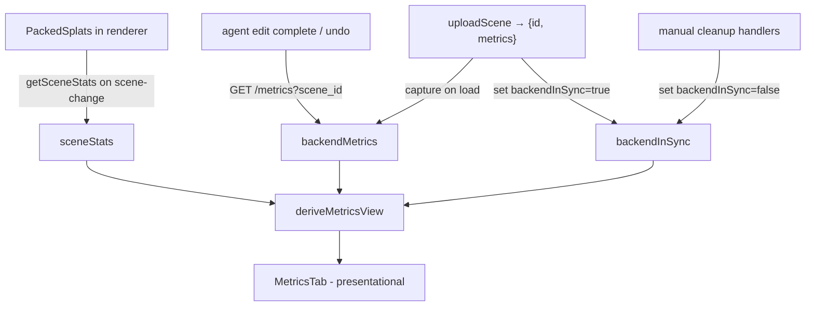

# Viewer Default Framing + Live Metrics Panel - Plan

> **Product Contract preservation:** Product Contract unchanged. Planning enriches the requirements-only artifact in place with HOW (Planning Contract, Implementation Units, Verification, Definition of Done); the WHAT below is carried verbatim from `ce-brainstorm`.

## Goal Capsule

**Objective.** Fix two frontend problems that make GeoSplat Inspector feel broken on real scenes:
1. The **default camera angle** lands at a grazing ~19° elevation, so wide/outdoor captures appear as a thin streak in black right after load.
2. The **metrics panel** is a hardcoded mockup (`—` everywhere, fake histogram) that displays no real data, even though real metrics already exist and go unused.

**Product authority.** Repo owner (rbh227). Approaches chosen during brainstorm: **A2** (aspect-aware framing) for angles, **B3** (hybrid metrics wiring) for the panel. Plan-time decisions confirmed: HEALTH stays visible after manual cleanups with a "last sync" label; a subtle non-black background is included.

**Open blockers.** None.

---

## Product Contract

### Problem & evidence

- **Framing:** A loaded outdoor `.ply` shows the scene collapsed into a horizontal sliver surrounded by black (observed in screenshot, 2026-06-29). Confirmed by the owner to be the view **right after load**, not an orbit limitation — so the default camera pose is the fault, not scene orientation.
- **Metrics:** `src/ui/InspectorPanel.tsx` `MetricsTab` renders every value as `"—"` (lines 24–30) and a static histogram array (line 43). Meanwhile `SceneManager.getSceneStats()` computes real stats and is exposed via `ViewerHandle`/`ViewerCanvas` but is **called by nothing**, and the backend's richer metrics are returned by `uploadScene` then discarded in `App.tsx` (only `{id}` is kept, ~line 71).

### Users & value

A peer running the tool locally to inspect/clean a splat scene. Value: the scene is **viewable at a sensible angle without manual orbiting**, and the panel **tells them whether the scene is messy and why** (the numbers that justify each cleanup action), instead of showing dead placeholders.

### Workstream A — Aspect-aware default framing (A2)

Requirements:
- (RA1) The default camera pose after load must present the scene at a **non-grazing angle** for wide/flat scenes (target elevation ~45–55° when the scene's vertical extent is small relative to its horizontal extent).
- (RA2) Framing distance must **fill the frame** with the scene's dense core — use **percentile-based bounds** of the core, not raw positional std, so the subject isn't tiny.
- (RA3) Compact/object-like scenes must remain well-framed (no regression for the existing `clean.ply` / `messy.ply` sphere demos).
- (RA4) Elevation and distance are derived from the scene's measured per-axis extent (aspect ratio), reusing the position sampling already in `computeFraming()`.
- (RA5) A subtle non-black canvas clear color so a small/distant subject isn't lost in black margins.
- **Out of scope for A2:** automatic up-axis detection (PCA) — the owner can orbit to good angles, so the up-axis is not wrong; keep the existing `mesh.rotation.x = Math.PI`.

### Workstream B — Hybrid live metrics panel (B3)

The panel sources data opportunistically and degrades gracefully:
- **Always (frontend `getSceneStats()`):** works for every scene including view-only.
- **When a backend `.ply` scene is registered:** layer in the backend diagnostic fractions (capture the metrics `App.tsx` currently discards on upload; refresh after each agent edit/undo via `GET /metrics`).

Displayed content, ordered by usefulness to cleanup:
1. (RB1) **SCENE** — Gaussians (live count), Visible/alive (updates after cleanup), Bounds size.
2. (RB2) **HEALTH** (decision-driving) — Floaters %, Outliers %, Needles %, Oversized %. Color amber/red when a value crosses its display threshold. Sourced from backend; shown with a "last sync" label when the backend is not in sync with the rendered scene (after manual frontend-only cleanups); hidden for view-only scenes.
3. (RB3) **DISTRIBUTIONS** — real opacity + scale histograms from `getSceneStats()` (replace the fake bars).
4. (RB4) **PALETTE** — dominant-color swatches (`getSceneStats()` already returns top-5).

Requirements:
- (RB5) No hardcoded metric values or placeholder histograms remain.
- (RB6) The panel updates when the scene changes (load, cleanup, undo, agent edit).
- (RB7) View-only scenes show sections 1, 3, 4; registered `.ply` scenes additionally show section 2.

### Scope boundaries

- **In:** `src/viewer/SceneManager.ts` (framing + clear color), `src/ui/InspectorPanel.tsx` (panel), `src/App.tsx` (pass stats/metrics + capture backend metrics + sync flag), `src/backend/client.ts` (add `getMetrics`), new pure helper modules + tests.
- **Deferred for later:** auto up-axis detection; ground-plane detection; region-scoped metrics; sending only changed indices on edit.
- **Outside this product's identity:** no new backend endpoints (`GET /metrics?scene_id=` already exists); no changes to `backend/contracts/` (frozen).

### Success criteria

- (SC1) Loading the outdoor scene from the 2026-06-29 screenshot lands at a clearly readable angle with the subject filling most of the frame (verified by screenshot).
- (SC2) The sphere demos still frame correctly (no regression).
- (SC3) The metrics panel shows live, correct numbers that change on load/cleanup/undo; HEALTH fractions appear for `.ply` scenes and color-flag when thresholds are exceeded.

### Dependencies / assumptions

- `getSceneStats()` output is sufficient for sections 1, 3, 4 (verified: returns `count`, `bbox`, `opacityHistogram`, `scaleHistogram`, `dominantColors`).
- **Resolved (was an open assumption):** backend `GET /metrics?scene_id=` exists (`backend/api/routes.py:89`, exercised by `backend/api/tests/test_rest.py:52`) and returns the §6.4 `Metrics` shape. Field paths confirmed in `backend/contracts/metrics.py`: floaters = `opacity.nearTransparentFraction`, outliers = `spatial.outlierFraction`, needles = `scale.axisRatio.needleFraction`, oversized = `scale.oversizedFraction`.

### Outstanding questions

- Metrics panel **layout** (visual arrangement of the four sections) is not yet fixed — to be decided at build time, optionally via a quick local layout preview. Content and data sources are fully specified.

---

## Planning Contract

### Research summary

- **Test setup:** vitest + jsdom, `include: ['src/**/*.test.ts']` — pure-logic tests only, no React Testing Library. Existing examples: `src/backend/client.test.ts`, `src/backend/trace.test.ts`. → Plan extracts pure helpers and tests those; no component/DOM test infra added.
- **Framing today:** `SceneManager.computeFraming()` (private) samples splat positions (strided), computes mean + hypot-of-per-axis-std for radius, and `frameScene()` places the camera at `center + (0.6r, 0.4r, 1.0r)` ≈ 19° elevation. `packedSplats` centers are mesh-local; the mesh carries `rotation.x = π`, so framing transforms the core center through `matrixWorld`.
- **Metrics today:** `getSceneStats()` is fully wired through `ViewerHandle`/`ViewerCanvas` but unused. `uploadScene` returns `{id, metrics}` (`src/backend/client.ts`); `App.tsx` discards `metrics`. Manual cleanups (`cleanOpacity`/`removeOutliers`/`cropBbox` etc.) mutate frontend `PackedSplats` only and never touch the backend.
- **No external research** — internal viewer/UI code with strong local patterns. No `docs/solutions/` learnings exist.

### Key technical decisions

- **KTD1 — Extract framing math into a pure module.** Move the geometry into `src/viewer/framing.ts` as a pure function over plain arrays (no THREE types), so it is unit-testable under the existing `.test.ts` glob. `SceneManager` samples positions, transforms them to **world space** (resolving the Y-flip) before calling the helper, and applies the returned camera position/target directly. Rationale: the streak bug is a math bug; making the math testable is the highest-leverage guard against regressions (RA3, SC2).
- **KTD2 — Aspect-aware elevation + percentile distance.** The helper derives elevation from the ratio of vertical extent to horizontal extent (flat/wide → higher elevation ~45–55°; tall → lower) and distance from **percentile bounds** (e.g. 5th/95th per axis) of the sampled points so far-flung floaters neither shrink the subject nor tilt the frame (RA1, RA2).
- **KTD3 — Metric display derivation is a pure helper.** A `deriveMetricsView(stats, backendMetrics, backendInSync)` function in `src/ui/metricsView.ts` maps raw inputs into a render-ready view model (scene rows, health rows with severity flags, normalized histogram bars, palette swatches, `hasBackend`/`stale` flags). `MetricsTab` becomes presentational. Rationale: matches the repo's pure-logic test pattern; keeps threshold/severity logic testable.
- **KTD4 — Display thresholds live in the helper, separate from detection constants.** HEALTH coloring (normal/amber/red) uses presentation thresholds defined in `metricsView.ts`, distinct from the backend's physics detection constants in `backend/contracts/constants.py`. Rationale: "when is 4% floaters worth flagging" is a UX choice, not the detection cutoff.
- **KTD5 — Backend-in-sync flag drives the "last sync" label.** `App.tsx` holds `backendInSync`: true after upload and after an agent edit reload; set false by the manual cleanup handlers. HEALTH renders with a "last sync" chip when `!backendInSync` rather than hiding (confirmed). Rationale: manual cleanups don't reach the backend, so the fractions can lag; labeling is honest without losing the data.
- **KTD6 — Recompute frontend stats on scene-change signals, not every frame.** `getSceneStats()` iterates all splats several times, and `ViewerState` updates every ~1s on the FPS tick. App recomputes `sceneStats` only when `fileName`/`splatCount`/`undoCount` change, not on FPS ticks. Rationale: avoid per-second full-scene scans (R5-adjacent perf).

---

## High-Level Technical Design

Dual-source metrics wiring (Workstream B):

SCENE/DISTRIBUTIONS/PALETTE always come from `sceneStats` (fresh); HEALTH comes from `backendMetrics`, labeled "last sync" when `backendInSync` is false.

---

## Implementation Units

### U1. Aspect-aware default framing + subtle background

**Goal.** Replace the grazing default camera pose with aspect-aware framing so wide/outdoor scenes load at a readable angle, and lift the canvas background off pure black. (RA1, RA2, RA4, RA5, SC1, SC2)

**Dependencies.** None.

**Files.**
- `src/viewer/framing.ts` (new) — pure framing math.
- `src/viewer/framing.test.ts` (new) — unit tests.
- `src/viewer/SceneManager.ts` (modify) — call the helper from `computeFraming()`/`frameScene()`; set a non-black `renderer.setClearColor`/scene background.

**Approach.** Extract a pure function that takes world-space sampled points (and camera FOV + aspect) and returns `{ target, position }` (or `{ center, radius, elevationRad, azimuthRad }` the caller converts). Compute robust per-axis extent via percentiles; pick elevation from vertical-vs-horizontal extent ratio; pick distance so the horizontal extent fills the frame for the given FOV. `SceneManager` keeps the existing strided sampling, transforms samples through `matrixWorld` before calling, and applies the result. Add a subtle dark (not pure-black) clear color in the constructor.

**Patterns to follow.** Existing strided sampling and `matrixWorld` transform in `SceneManager.computeFraming()`; pure-module + `.test.ts` pattern from `src/backend/trace.ts`/`trace.test.ts`.

**Test scenarios** (`src/viewer/framing.test.ts`):
- Wide-flat cloud (large X/Z spread, tiny Y) → returned camera elevation above a grazing threshold (e.g. > 35°); target at core center. *Covers SC1.*
- Cube-like cloud → moderate elevation (~30–45°), distance frames the cube without excess black.
- Tall cloud (large Y, small X/Z) → lower elevation than the flat case.
- Floaters present (dense core + a few far points) → percentile bounds ignore outliers; center and distance match the no-floater dense-core case within tolerance. *Regression guard for the streak bug; Covers SC2.*
- Degenerate input (0 or 1 point) → returns `null`/safe fallback, no NaN.

**Verification.** `framing.test.ts` passes; loading the 2026-06-29 outdoor scene lands at a readable angle (screenshot); sphere demos unchanged (screenshot).

### U2. Metrics data plumbing (App + client)

**Goal.** Stop discarding backend metrics, add a refresh path, compute frontend stats on scene-change, and feed all of it (plus the sync flag) to the panel. (RB1, RB6, RB7, KTD5, KTD6)

**Dependencies.** None (parallel to U1; consumed by U3).

**Files.**
- `src/backend/client.ts` (modify) — add `getMetrics(sceneId): Promise<Record<string, unknown>>` calling `GET /metrics?scene_id=`.
- `src/backend/client.test.ts` (modify) — cover the new helper's URL/parse/error path.
- `src/App.tsx` (modify) — capture `metrics` from `uploadScene`; hold `backendMetrics`, `sceneStats`, `backendInSync`; refresh `backendMetrics` after agent `complete` (non-error) and after undo; set `backendInSync=false` in manual cleanup handlers, `true` on upload/agent reload; recompute `sceneStats` from `viewerRef.getSceneStats()` on `fileName`/`splatCount`/`undoCount` change; pass the three values to `InspectorPanel`.

**Approach.** Mirror the existing `uploadScene`/`runAgent` fetch style in `client.ts`. In `App.tsx`, extend the existing `processTrace` `complete` branch (which already reloads the edited `.ply`) to also call `getMetrics` and set `backendInSync=true`. Manual cleanup callbacks (`handleCleanOpacity`, `handleRemoveOutliers`, `handleCrop`) set `backendInSync=false`.

**Patterns to follow.** `uploadScene`/`runAgent` in `src/backend/client.ts`; the `complete` handling in `App.tsx` `processTrace`.

**Test scenarios** (`src/backend/client.test.ts`):
- `getMetrics` builds the correct `GET /metrics?scene_id=<id>` URL (same-origin and `VITE_BACKEND_URL` cases, mirroring existing client tests).
- Non-OK response → throws with status + detail (matches `uploadScene` error contract).
- OK response → returns parsed JSON object.

**Verification.** `client.test.ts` passes; manual: after an agent run the panel HEALTH updates; after a manual cleanup the "last sync" label appears.

### U3. Live metrics panel (derivation helper + MetricsTab rewrite)

**Goal.** Render real SCENE / HEALTH / DISTRIBUTIONS / PALETTE from props, with threshold coloring, the "last sync" label, and graceful degradation. Remove all hardcoded values. (RB1–RB5, RB7, SC3, KTD3, KTD4)

**Dependencies.** U2 (provides the props).

**Files.**
- `src/ui/metricsView.ts` (new) — `deriveMetricsView(stats, backendMetrics, backendInSync)` → render-ready view model + display thresholds.
- `src/ui/metricsView.test.ts` (new) — unit tests.
- `src/ui/InspectorPanel.tsx` (modify) — `MetricsTab` consumes the view model; remove the `—` rows and the static histogram array; thread new props from `App` through `InspectorPanel` into `MetricsTab`.

**Approach.** The helper reads the confirmed field paths (`opacity.nearTransparentFraction`, `spatial.outlierFraction`, `scale.axisRatio.needleFraction`, `scale.oversizedFraction`, plus `opacity.mean`, `bounds`) and `SceneStats` (count, histograms, dominantColors), returning rows with values, severity (`normal`/`amber`/`red`), normalized bar heights, palette swatches, and `hasBackend`/`stale` flags. `MetricsTab` maps the model to the existing visual style (reuse the current bar markup, fed by real buckets).

**Patterns to follow.** Existing `MetricRow`/histogram markup in `InspectorPanel.tsx` (keep the look, swap the data); pure-helper + `.test.ts` pattern.

**Test scenarios** (`src/ui/metricsView.test.ts`):
- Full backend + stats, `inSync=true` → all four sections populated; `stale=false`; health severities computed.
- `inSync=false` → `stale=true` (drives the "last sync" label).
- No backend metrics (view-only), stats present → `hasBackend=false`, HEALTH omitted; SCENE/DISTRIBUTIONS/PALETTE present. *Covers RB7.*
- `stats=null` and `backendMetrics=null` → safe empty model, no throw.
- Health severity: fraction below threshold → `normal`; above amber → `amber`; above red → `red`, checked per metric (floaters/outliers/needles/oversized). *Covers SC3.*
- Histogram normalization: bars scale to the max bucket; all-zero buckets → no NaN heights.

**Verification.** `metricsView.test.ts` passes; manual: load `messy.ply` → HEALTH flags amber/red and histograms/palette reflect the scene; load a view-only `.splat` → SCENE/DISTRIBUTIONS/PALETTE show, HEALTH hidden; numbers change after cleanup/undo.

---

## Verification Contract

- `npm test` (vitest) — all new and existing tests pass.
- `npm run build` (`tsc -b` + vite) — type-checks and builds clean.
- `npm run lint` — no new lint errors.
- Manual screenshot checks: outdoor scene readable angle (SC1); sphere demos unchanged (SC2); panel live + HEALTH coloring on `messy.ply`, graceful view-only degradation (SC3).

---

## Definition of Done

- SC1, SC2, SC3 met and screenshot-verified.
- No `—` placeholders or hardcoded histogram data remain in `MetricsTab`.
- HEALTH shows the "last sync" label after manual cleanups; subtle non-black background present.
- Verification Contract gates green.
