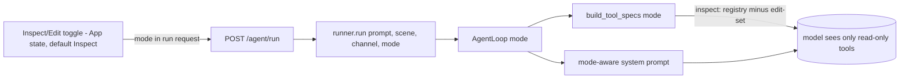

# Inspector-First Agent Mode (Inspect / Edit) - Plan

> **Product Contract preservation:** Product Contract unchanged. Planning enriches the requirements-only artifact in place with HOW (Planning Contract, Implementation Units, Verification, Definition of Done).

## Goal Capsule

**Objective.** Shift the agent's default identity from *cleaner* to *inspector*: its primary loop is move + capture + analyze. Cleaning becomes an explicit **Edit mode** the user opts into, not the model's reflex. The agent must never edit the scene unless the user has switched to Edit mode.

**Product authority.** Repo owner (rbh227). Brainstorm decisions: intent is set by an **explicit user mode toggle** (the model never chooses the mode); in Inspect mode the agent stays neutral and only discusses cleanup if the user asks about quality.

**Open blockers.** None.

---

## Product Contract

### Problem & evidence

Observed live this session (Qwen2.5-VL-7B local model): asked to **"orbit around the scene slowly"**, the agent orbited ~1° then ran `remove_needles` + `opacity_threshold` (unasked) and claimed it cleaned the scene. Asked **"what is in this scene"**, it ran `remove_outliers` (unasked) and answered with Gaussian *counts* instead of describing what's visible. Two causes: (1) `backend/agent/system_prompt.py` frames the agent's identity around the floater-cleanup flow; (2) the small model has weak instruction-following and pattern-matches every prompt onto inspect→clean→answer. The agent has good navigation/vision tools — it just doesn't treat looking and describing as its job.

### Users & value

A person inspecting a splat scene gets an agent that actually **flies around, captures good views, and tells them what's in the scene** — and that **never edits unless they deliberately enter Edit mode**. Cleaning stays available, but as an explicit choice rather than an unpredictable side effect.

### Requirements

- (R1) **Two explicit, user-controlled modes:** **Inspect** (default) and **Edit**. The user sets the mode via a toggle; the model never selects or changes the mode.
- (R2) **Tool-gating by mode.** In Inspect mode, only read-only tools are offered to the model — navigation (`look_at`, `set_view`, `orbit`, `dolly`, `frame_object`, `reset_view`), capture (`capture_frame`, `capture_orbit`), pacing/overlay (`scan_pause`, `drop_marker`, `clear_markers`, `narrate`, `reset_trail`), analysis (`get_metrics`, `list_problem_regions`), and `answer`. The mutating cleanup/export tools are **not in the model's tool list at all**. In Edit mode the mutating tools (`opacity_threshold`, `remove_outliers`, `remove_needles`, `prune_oversized`, `crop_bbox`, `crop_sphere`, `recolor`, `adjust_opacity`, `truncate_sh`, `snapshot`, `undo`, `redo`, `export_ply`) are additionally available. Edit is a **superset** — navigation/capture still work in Edit mode.
- (R3) **Gating happens at tool-selection time**, by filtering which `ToolSpec`s are offered per run. The frozen `TOOL_REGISTRY` (`backend/contracts/tools.py`) is **not** modified.
- (R4) **Inspector-first, mode-aware system prompt.** Reframe `backend/agent/system_prompt.py` so the default identity is navigate/look/describe. The prompt is mode-aware: in Inspect mode it states the agent inspects and does not edit; the cleanup guidance applies only in Edit mode.
- (R5) **Vision-first answers in Inspect mode.** "What is in this scene" is answered by describing the **visible content** (from a captured frame) — objects, layout, setting — not by reporting Gaussian counts. Metrics answer only explicitly quantitative questions ("how many / how messy").
- (R6) **Neutral cleanup policy in Inspect mode.** The agent describes the scene neutrally and only discusses cleanliness/cleanup **if the user asks about quality**. No unsolicited cleanup suggestions.
- (R7) **Inspect is the default** on every new scene / session.

### Scope boundaries

- **In:** the `system_prompt.py` reframe (mode-aware); mode-based tool-gating at selection/dispatch; the frontend mode toggle and threading the mode into the agent run; default-Inspect; vision-first answer behavior.
- **Deferred for later:** autonomous best-view search, guided inspection tour, multi-view contact sheet (ideation ideas #4/#5, `docs/ideation/2026-06-29-agent-inspector-identity.html`); keyword auto-routing or a cheap classifier (explicit toggle was chosen over these).
- **Outside this product's identity:** changing the frozen tool contract; removing cleanup capability (it is gated, not deleted); letting the model choose its own mode.

### Success criteria

- (SC1) In Inspect mode, "orbit around the scene slowly" produces only camera/narrate actions and **zero** mutating tool calls (verifiable in the run trace).
- (SC2) In Inspect mode, "what is in this scene" returns a **description of the visible content**, not a Gaussian-count dump.
- (SC3) The model in Inspect mode has **no mutating tools** in its offered tool list (verifiable in the specs passed to the provider).
- (SC4) Switching to Edit mode makes cleanup work as it does today.

### Dependencies / assumptions

- **Verified:** `build_tool_specs()` (`backend/agent/system_prompt.py`) maps the frozen `TOOL_REGISTRY`; `backend/agent/types.py` defines `DESTRUCTIVE_TOOLS` (9 cleanup ops); `AgentLoop.__init__` accepts a `system_prompt` and builds `self.tools`; the run path is `POST /agent/run` → `runner.run(prompt, scene, channel)` → `backend/api/real_engine.py` builds `AgentLoop(...)` and calls `loop.run(prompt)`.
- **Assumption:** the agent-run request can carry a `mode` field threaded through to `AgentLoop` (confirmed feasible; this plan wires it).

### Outstanding questions

- Whether mode **persists** within a session or resets to Inspect on every new scene — plan defaults to Inspect on new scene (R7); intra-session persistence is a UI detail left to the implementer.

---

## Planning Contract

### Research summary

- **Tool partition source:** `DESTRUCTIVE_TOOLS` (`backend/agent/types.py`) holds the 9 cleanup ops; it does **not** include `snapshot`/`undo`/`redo`/`export_ply`. The Edit-only set is therefore `DESTRUCTIVE_TOOLS ∪ {snapshot, undo, redo, export_ply}`; Inspect = `TOOL_REGISTRY` minus that set.
- **Gating seam:** `build_tool_specs()` returns specs for all of `TOOL_REGISTRY`; `AgentLoop.__init__` sets `self.tools = build_tool_specs()` and `run()` passes `self.tools` to the provider each step. Gating = parameterize `build_tool_specs(mode)` and thread `mode` into `AgentLoop`.
- **Run path:** `backend/api/routes.py` `agent_run` (`AgentRunRequest{scene_id, prompt}`) → `runner.run(req.prompt, state.scene, channel)` → `real_engine.py` builds `AgentLoop(provider, dispatcher, channel)` and calls `loop.run(prompt)`. Adding `mode` means: extend the request schema, thread `mode` through `runner.run` → `AgentLoop`.
- **Frontend run path:** `src/backend/client.ts` `runAgent(sceneId, prompt)` POSTs `{scene_id, prompt}`; `src/App.tsx` `handleSend` calls it. No mode concept exists yet.
- **Test setup:** backend `pytest` (`backend/agent/tests/`, `backend/api/tests/`); frontend `vitest` jsdom, pure-logic `.test.ts` only (no React Testing Library).
- **No external research** — internal agent/loop/prompt wiring with strong local patterns.

### Key technical decisions

- **KTD1 — Gate by filtering `build_tool_specs` with the existing destructive set.** Define the Edit-only set as `DESTRUCTIVE_TOOLS ∪ {snapshot, undo, redo, export_ply}` (a named set near `DESTRUCTIVE_TOOLS` in `types.py`). `build_tool_specs(mode)` returns the full registry minus that set when `mode == "inspect"`. The frozen `TOOL_REGISTRY` is untouched (R3). Rationale: reuse the one existing source of truth for "mutating," and gate by exclusion so new read-only tools are inspect-available by default.
- **KTD2 — One mode-aware system prompt, not two files.** Keep a single inspector-first base prompt plus a small mode-conditional block: Inspect states "you navigate, look, and describe; you do not edit — you have no edit tools" and carries the vision-first + neutral-cleanup rules (R5, R6); Edit appends the existing cleanup guidance. Rationale: avoid two prompts drifting apart; the tool list already enforces the hard constraint, the prompt sets intent.
- **KTD3 — `mode` is an explicit param threaded end-to-end, defaulting to `inspect`.** Request → `runner.run` → `AgentLoop(mode=...)`. The model never sees or sets the mode; enforcement is structural (which tools/prompt it receives). Rationale: matches the brainstorm decision (explicit toggle, model never chooses) and is robust to a weak model.
- **KTD4 — Frontend mode is App state, default Inspect, reset on new scene.** A simple two-state toggle near the prompt; `runAgent` gains a `mode` argument. Rationale: R1/R7; smallest UI surface.

---

## High-Level Technical Design

Mode flows one way, from the user's toggle to which tools the model is even shown:

In Inspect mode the model's tool list contains no mutating tool, so it cannot edit regardless of what it tries; the prompt sets inspector intent and the vision-first/neutral-cleanup behavior.

---

## Implementation Units

### U1. Mode-aware tool-gating + system prompt (backend agent)

**Goal.** Make the agent's tool list and system prompt depend on a `mode` ("inspect" | "edit"), with Inspect excluding all mutating tools and carrying inspector-first / vision-first / neutral-cleanup intent. (R2, R3, R4, R5, R6, SC3, KTD1, KTD2, KTD3)

**Dependencies.** None.

**Files.**
- `backend/agent/types.py` (modify) — add the Edit-only tool set (`DESTRUCTIVE_TOOLS ∪ {snapshot, undo, redo, export_ply}`).
- `backend/agent/system_prompt.py` (modify) — `build_tool_specs(mode)` filters the registry by mode; reframe `SYSTEM_PROMPT` to inspector-first with a mode-conditional block (a `system_prompt_for(mode)` helper).
- `backend/agent/loop.py` (modify) — `AgentLoop.__init__` accepts `mode` (default `"inspect"`), builds `self.tools = build_tool_specs(mode)` and uses `system_prompt_for(mode)`.
- `backend/agent/tests/test_tool_gating.py` (new).

**Approach.** Add a named Edit-only set in `types.py`. `build_tool_specs(mode)` returns specs for `TOOL_REGISTRY` minus the Edit-only set when `mode=="inspect"`, full set when `"edit"`. Replace the module-level `SYSTEM_PROMPT` constant usage with a `system_prompt_for(mode)` builder: shared inspector-first base + Inspect block (no-edit, vision-first describe, neutral cleanup) or Edit block (cleanup guidance). `AgentLoop` takes `mode` and wires both. Keep `answer`, navigation, capture, metrics, markers, narrate in Inspect.

**Patterns to follow.** Existing `build_tool_specs` / `SYSTEM_PROMPT` in `system_prompt.py`; `DESTRUCTIVE_TOOLS` set in `types.py`; existing prompt tone.

**Test scenarios** (`backend/agent/tests/test_tool_gating.py`):
- `build_tool_specs("inspect")` returns no spec whose name is in the Edit-only set; includes `orbit`, `capture_frame`, `get_metrics`, `narrate`, `answer`. *Covers SC3.*
- `build_tool_specs("edit")` includes every `DESTRUCTIVE_TOOLS` name plus `snapshot`/`undo`/`redo`/`export_ply`, and still includes the navigation/capture tools (superset).
- `AgentLoop(..., mode="inspect").tools` contains no mutating tool; `mode="edit"` does. *Covers SC3.*
- `system_prompt_for("inspect")` contains the no-edit / describe-what-you-see framing and not the cleanup-flow guidance; `system_prompt_for("edit")` contains the cleanup guidance.
- Default mode (omitted arg) behaves as `"inspect"`. *Covers R7.*

**Verification.** Tests pass; in an Inspect-mode loop, the specs passed to the provider exclude every mutating tool.

### U2. Thread `mode` through the run path (backend API)

**Goal.** Carry `mode` from the agent-run request to `AgentLoop`, defaulting to `"inspect"`. (R1, R7, SC1, SC4, KTD3)

**Dependencies.** U1 (consumes `AgentLoop(mode=...)`).

**Files.**
- `backend/api/schemas.py` (modify) — add `mode: str = "inspect"` to `AgentRunRequest`.
- `backend/api/routes.py` (modify) — pass `req.mode` into `runner.run(...)`.
- `backend/api/engine.py` (modify) — extend the runner `run` signature with `mode`.
- `backend/api/real_engine.py` (modify) — pass `mode` into `AgentLoop(...)`.
- `backend/api/stub_engine.py` / `backend/api/stub_agent.py` (modify if they implement the runner `run` signature) — accept and ignore `mode` to keep the interface uniform.
- `backend/api/tests/test_rest.py` (modify).

**Approach.** Add `mode` (validated to `"inspect"`/`"edit"`, default `"inspect"`) to the request model; thread it through the runner interface to `AgentLoop`. Keep backward compatibility: a request without `mode` runs Inspect.

**Patterns to follow.** Existing `AgentRunRequest` and `runner.run` signature in `routes.py`/`real_engine.py`/`engine.py`.

**Test scenarios** (`backend/api/tests/test_rest.py`):
- `POST /agent/run` without `mode` is accepted and runs as Inspect (default).
- `POST /agent/run` with `mode:"edit"` is accepted; with an invalid mode returns a validation error.
- The runner receives the request's `mode` and constructs the loop with it (assert via the stub runner or a spy). *Covers SC1/SC4 at the transport level.*

**Verification.** Tests pass; an `edit` request reaches `AgentLoop(mode="edit")`, an inspect/default request reaches `mode="inspect"`.

### U3. Frontend mode toggle + wiring

**Goal.** Add a user-facing Inspect/Edit toggle (default Inspect, reset on new scene) and send the selected mode with each agent run. (R1, R7, SC1, KTD4)

**Dependencies.** U2 (backend must accept `mode`).

**Files.**
- `src/backend/client.ts` (modify) — `runAgent(sceneId, prompt, mode)` includes `mode` in the POST body.
- `src/backend/client.test.ts` (modify) — cover the new arg.
- `src/App.tsx` (modify) — `mode` state (default `"inspect"`), reset to `"inspect"` on new scene load; pass `mode` to `runAgent`; pass mode + setter to the panel.
- `src/ui/InspectorPanel.tsx` (modify) — a two-state Inspect/Edit toggle near the prompt input.

**Approach.** Extend `runAgent` to send `mode`. Hold `mode` in `App` state, default Inspect, reset to Inspect in the scene-load paths (mirroring where `backendInSync`/scene state resets). Add a compact toggle in the prompt area; surface the current mode so the user knows whether the agent can edit.

**Patterns to follow.** `runAgent`/`uploadScene` in `client.ts`; the existing prompt area + state plumbing in `InspectorPanel.tsx` / `App.tsx`.

**Test scenarios** (`src/backend/client.test.ts`):
- `runAgent(id, "hi", "edit")` POSTs a body containing `mode:"edit"`; `runAgent(id, "hi", "inspect")` (or default) sends `mode:"inspect"`.
- Non-OK response still throws with status + detail (unchanged contract).
- *(UI toggle has no isolable logic for the pure-vitest setup; covered by the client test + manual verification — note no DOM test.)*

**Verification.** `client.test.ts` passes; manual: toggle shows mode; an Inspect-mode "orbit slowly" run does no editing; switching to Edit and asking to clean works.

---

## Verification Contract

- `pytest backend/` — U1 + U2 tests pass, no regressions.
- `npm test` (vitest), `npx tsc --noEmit`, `npm run lint` — U3 passes, clean.
- Manual (model up): in Inspect, "orbit around the scene slowly" → only camera/narrate, zero edits (SC1); "what is in this scene" → visible-content description, not counts (SC2); switch to Edit → "clean up this scene" works (SC4).

---

## Definition of Done

- SC1–SC4 met; the model's Inspect-mode tool list provably excludes mutating tools.
- Mode defaults to Inspect end-to-end; the model never sets the mode.
- Verification Contract gates green.
