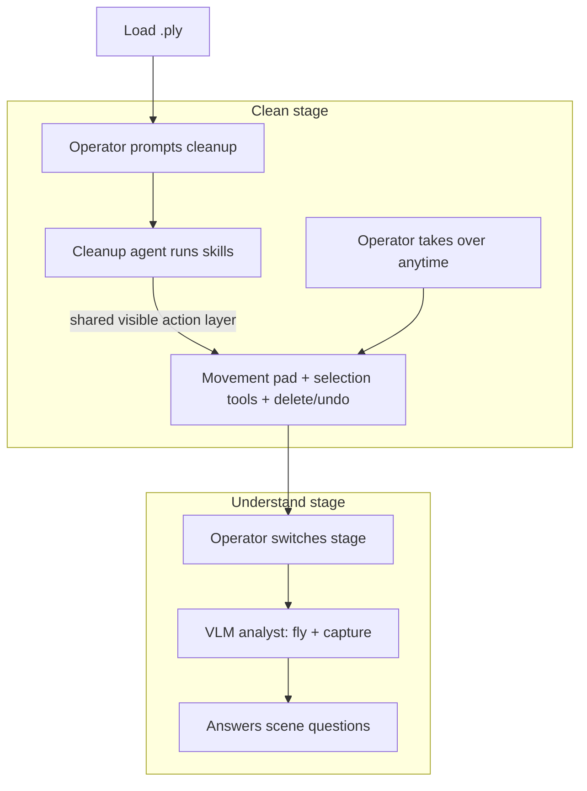
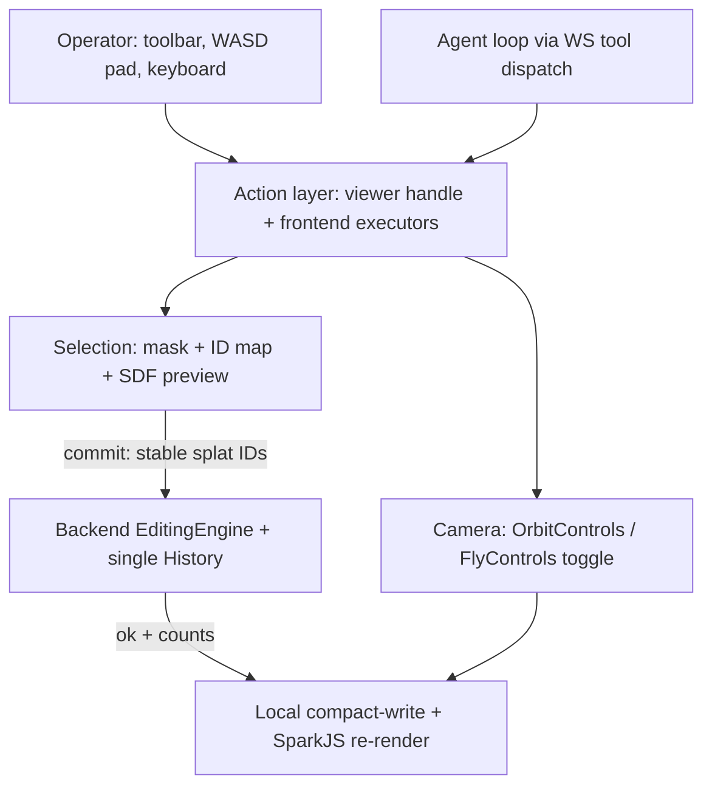
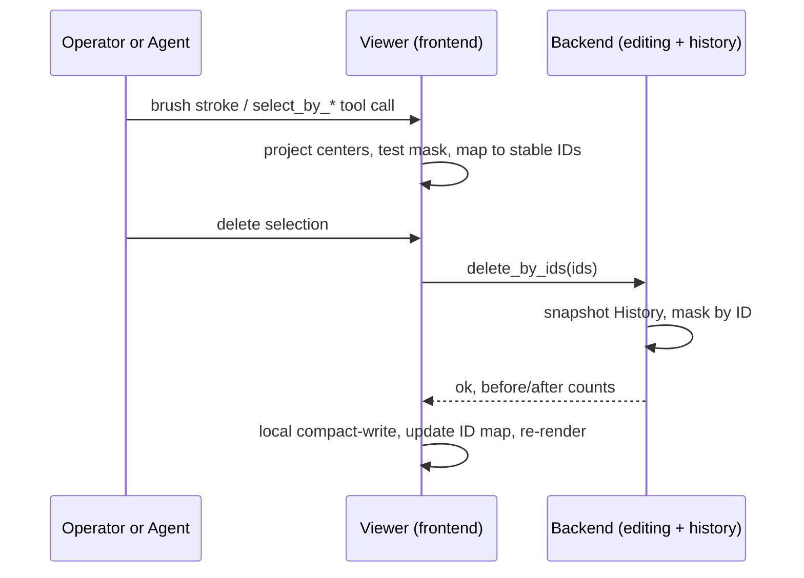
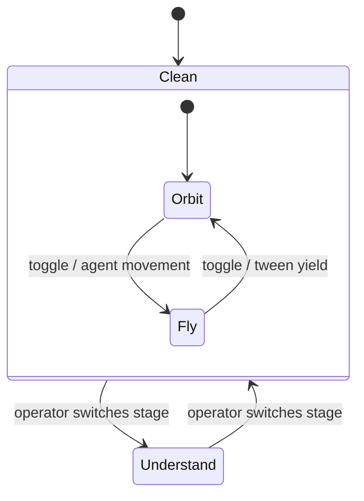

# Editor-First Rework (UI, Tools, Two-Stage Agent) - Plan

> **Product Contract preservation:** Product Contract unchanged. Planning resolved the "Deferred to Planning" questions in place (contract extension, fly/orbit coexistence, selection locus, skill format, pause mechanism) and confirmed the SuperSplat license assumption.

## Goal Capsule

- **Objective.** Rework SplatAgent into a classic professional splat editor (Postshot-style chrome) with SuperSplat-grade manual selection tools and an on-screen WASD movement pad, then rebuild the agent as a two-stage story: a cleanup agent that visibly operates the same tools a human uses, followed by a VLM analyst that navigates, captures views, and answers scene-understanding questions.
- **Product authority.** Repo owner (rbh227). Build order is fixed: editor phase (U1–U8) before agent phase (U9–U11). Owner has authorized extending the frozen contracts (version bump to v0.2) and deleting obsolete code.
- **Stop conditions.** Stop and surface if: a change would alter the Product Contract's stage semantics (agents switching stages themselves), the contracts extension breaks existing agent runs, or undo unification proves impossible without data loss.
- **Open blockers.** None.

---

## Product Contract

### Summary

SplatAgent becomes an editor-first tool: quiet dark professional chrome, brush/lasso/polygon/sphere/box selection with delete/keep/undo, a game-style WASD pad in the viewport corner, and no metrics or suggested-prompt panels on screen. Agent capabilities are packaged as named skills built from those same tools; a cleanup agent runs them visibly in a Clean stage, and a VLM analyst answers scene questions in an Understand stage.

### Problem Frame

The project is a research proof-of-concept for AI-assisted damage assessment on 3D Gaussian Splatting scenes (e.g., post-disaster captures). The current frontend is chat-first: a capabilities panel of suggested prompts, a metrics/inspector panel, and a free-prompt agent with 29 registered tools. Live sessions showed the failure shape: a small VLM given free range pattern-matches every prompt onto its cleanup reflex (running `remove_outliers` when asked "what is in this scene"), and the chat-centric UI reads as a toy rather than a credible tool.

The demo that matters is: load a messy post-disaster `.ply`, tell the agent to clean it, watch it fly around and erase floaters with the same tools a human editor would use, step in manually where it falls short, then ask it questions like "how many damaged buildings?" and get grounded answers. Credibility comes from watchability — the agent using real, visible editor tools — not from a transcript of API calls.

### Key Decisions

- **Staged pipeline with a shared visible action layer.** Two explicit stages — Clean, then Understand — structure the app. Inside Clean, the cleanup agent operates through the same action layer as the human: WASD presses light up on the pad, brush strokes animate before splats vanish, and the human can take over at any moment. Chosen over a single free-form workspace because the stage boundary is what prevents the agent-blur failure (editing when asked to describe) already observed in this repo.
- **Skills over free-range prompting.** Capabilities are named, pre-built routines (e.g., "hover around", "clean floaters", "survey the scene") composed from editor tools. The agent selects skills autonomously from a goal prompt, and the user can invoke one directly from chat. Small local models behave better choosing from a constrained menu than improvising tool sequences.
- **Reuse SuperSplat's open-source tool code.** SuperSplat (PlayCanvas) is a browser-based TypeScript splat editor with the exact selection grammar needed. Its code is MIT-licensed; borrow selection math and tool behavior rather than reinventing. No C++ needed — CloudCompare's tools are prior art for behavior only.
- **Classic professional UI, Postshot as reference.** Dark modest chrome, left vertical toolbar, right-side panels, nothing flashy. Metrics readouts and the suggested-prompts panel are removed from the screen entirely.
- **Metrics leave the UI, not the backend.** The backend keeps computing metrics because the cleanup agent's edit-verification loop (re-measure after destructive edit, undo on failure) depends on them. Nothing on screen displays them.
- **UI and tools before agent.** The editor must stand alone as a usable manual tool first; the agent rework follows once the tool layer is solid.
- **Supersedes prior plans.** This absorbs `docs/plans/2026-06-29-002-feat-inspector-first-agent-mode-plan.md` (its Inspect/Edit tool-gating mechanism survives as the stage-gating mechanism) and retires the metrics-panel half of `docs/plans/2026-06-29-001-feat-viewer-framing-and-metrics-plan.md` (its camera-framing half remains valid).

### Actors

- A1. **Operator** — the researcher running a demo or working a scene. Loads files, prompts agents, invokes skills, and edits manually with the same tools.
- A2. **Cleanup agent** — works only in the Clean stage. Given a goal ("clean this scene"), it composes skills: navigates with the movement controls, selects with the editor tools, deletes, verifies, retries.
- A3. **VLM analyst** — works only in the Understand stage. Navigates and captures 2D views to answer scene-understanding questions ("how many damaged buildings?", "what is this scene showing?"). Read-only: no editing tools available to it.

### Requirements

**UI shell**

- R1. The app presents a classic desktop-editor layout in the Postshot mold: dark professional chrome, left vertical tool toolbar, viewport-dominant center, right-side panel area, top bar with stage switcher.
- R2. The metrics/inspector readouts and the suggested-prompts capabilities panel are removed from the UI.
- R3. A chat panel hosts the agent conversation and the skill list; skills are visible as named, clickable entries and invocable by typed command.

**Editor tools (manual)**

- R4. Selection tools: brush (paintable circle, adjustable size), lasso (freehand outline), polygon (click-point outline), sphere volume, and box volume — SuperSplat's grammar.
- R5. Selection actions: delete selected, keep-only selected (delete inverse), invert selection, clear selection.
- R6. Every edit is undoable/redoable, including edits made by the agent, in one shared history.
- R7. Tool behavior ports or adapts SuperSplat's open-source implementation where practical rather than being written from scratch.

**Movement and navigation**

- R8. An on-screen movement pad sits in a viewport corner: WASD (+ up/down) buttons for fly-style navigation, usable by mouse/touch and keyboard.
- R9. The camera supports game-style free-fly movement in addition to the existing orbit behavior.

**Skills system**

- R10. Skills are named routines composed from the editor tools and movement controls (e.g., "hover around", "clean floaters", "frame and capture").
- R11. One skill list serves both invokers: the agent selects skills to satisfy a goal prompt, and the operator can trigger a skill directly from chat.

**Stages and agents**

- R12. The app has two explicit stages: Clean and Understand. The operator switches stages; agents never switch stages themselves.
- R13. In the Clean stage, the cleanup agent (A2) operates through the same action layer as the human: its movement shows on the pad, its tool use is visibly animated in the viewport, and every action it takes is one the operator could take by hand.
- R14. The operator can take over at any time during agent work: manual input pauses the agent, and the operator's fixes coexist with the agent's edits in the shared history.
- R15. In the Understand stage, the VLM analyst (A3) has navigation and capture only — no editing capability is offered to it.
- R16. The analyst answers scene-understanding questions by navigating and capturing 2D views, describing visible content rather than reporting Gaussian statistics.

### Key Flows

- F1. **Agent cleanup session**
  - **Trigger:** Operator loads a `.ply` and prompts "clean this scene" in the Clean stage.
  - **Actors:** A1, A2
  - **Steps:** Agent picks skills (survey → identify → select → delete → verify); its movement and tool strokes render visibly; backend verification re-measures after each destructive step and undoes failures; agent reports done.
  - **Outcome:** A visibly cleaner scene, every step watchable and individually undoable.
  - **Covers:** R6, R8, R10, R12, R13.
- F2. **Human touch-up**
  - **Trigger:** Operator sees leftovers the agent missed (or over-deletion).
  - **Actors:** A1
  - **Steps:** Operator pauses/interrupts the agent if running, picks a selection tool from the toolbar, brushes/lassos the region, deletes or undoes.
  - **Outcome:** Manual fixes land in the same history as agent edits.
  - **Covers:** R4, R5, R6, R14.
- F3. **Scene Q&A**
  - **Trigger:** Operator switches to the Understand stage and asks a question.
  - **Actors:** A1, A3
  - **Steps:** Analyst flies (visibly, via the same movement layer), captures 2D frames from chosen viewpoints, reasons over them, answers in chat.
  - **Outcome:** A grounded answer about visible scene content; the scene itself is untouched.
  - **Covers:** R12, R15, R16.

### Acceptance Examples

- AE1. **Covers R13, R14.** Given the cleanup agent is mid-run, when the operator presses W or picks the brush, then the agent pauses and the operator's input takes effect immediately; resuming is an explicit operator action.
- AE2. **Covers R15.** Given the Understand stage is active, when the analyst is asked anything ("clean this up" included), then no editing tool is available to it and the splat data is unchanged after the exchange.
- AE3. **Covers R16.** Given a cleaned post-disaster scene, when the operator asks "how many damaged buildings?", then the analyst navigates, captures views, and answers with a count and what it saw — not Gaussian counts or metrics.
- AE4. **Covers R6.** Given the agent deleted a region the operator wanted kept, when the operator hits undo, then exactly that agent edit reverts, regardless of who made surrounding edits.
- AE5. **Covers R11.** Given the skill list contains "hover around", when the operator invokes it from chat, then the same routine runs that the agent would run — same visible movement, same pacing.

### Success Criteria

- SC1. A full demo session — load messy scene, watch agent clean it with visible tool use, touch up by hand, switch stage, ask questions, get sensible answers — runs end to end without touching a metrics panel or suggested prompt.
- SC2. A viewer watching the cleanup can narrate what the agent is doing from the screen alone (which tool, where it's moving), without reading the chat transcript.
- SC3. The manual editor is independently usable: a human can clean a scene with brush/lasso/sphere + undo without any agent involvement.

### Scope Boundaries

**Deferred for later**

- Exact agent internals (loop design, model choice, prompt structure) — planned at skill/stage level now, refined across future sessions.
- Additional editor tools beyond the cleanup set (transform gizmos, splat painting/recoloring workflows).
- Quantitative accuracy evaluation of analyst answers (counts vs ground truth) — v1 bar is "sensible and grounded", not measured accuracy.
- Persistent sessions/projects across reloads (export of cleaned `.ply` remains).

**Outside this product's identity**

- Full SuperSplat parity: compression, splat transforms, animation timelines, publishing. Only tools the cleanup skills need.
- Training/reconstruction (Postshot's actual job) — this tool consumes `.ply`, never produces one from images.
- Free-range prompting as the primary interface — the constrained skill vocabulary is the identity, not a limitation to remove later.
- Production multi-user or hosted operation; this is a local research tool.

**Deferred to Follow-Up Work**

- Undo-snapshot memory optimization (delta compression or lower cap) — frontend snapshots cost 32 bytes/splat; at 600K+ splats a deep stack is heavy. Ship with a reduced cap; optimize later if large scenes hurt.
- Subject-survival verification guard (replacing the count-fraction `silhouette_intact` check) — a known weakness on noisy outdoor scenes, tracked in `docs/solutions/architecture-patterns/backend-frontend-coordinate-and-edit-guards.md`, orthogonal to this rework.

### Dependencies / Assumptions

- SuperSplat is MIT-licensed (verified: PlayCanvas Ltd, LICENSE in `playcanvas/supersplat`); attribution retained when porting code.
- The backend metrics/verification loop stays as-is and keeps serving the cleanup agent (verified: re-measure + verify + conditional undo in `backend/agent/loop.py`).
- The COLMAP-Y-down vs Three.js-Y-up gotcha applies to every new spatial tool; all backend↔frontend coordinates route through `toRenderSpace()` (`frontend/src/agent/camera.ts`), and all splat-center projections apply `splatMesh.matrixWorld`.
- The repo's multi-agent boundary map in `CLAUDE.md` (Agents 1–5, frozen contracts) reflects the Phase-0 build process; the owner has authorized contract versioning and cross-boundary edits for this rework.

### Outstanding Questions

**Deferred beyond planning**

- Analyst question taxonomy and answer grounding method (per-capture VLM calls vs multi-image reasoning) — refined during the agent phase.
- Whether the trace/activity view survives inside the chat panel or disappears with the inspector — implementer judgment at U7.

---

## Planning Contract

### Key Technical Decisions

- KTD1. **Contracts version bump to v0.2.** Extend `backend/contracts/tools.py` and its mirror `frontend/src/contracts.ts` with the new tools (below) and new WS message types (`edit_by_ids` request path, `agent_pause`/`agent_resume` signals). The freeze becomes per-phase: v0.1 froze the Phase-0 build; v0.2 freezes when the editor phase lands. New tools: `select_by_brush`, `select_by_lasso`, `select_by_polygon`, `select_by_sphere`, `select_by_box`, `invert_selection`, `clear_selection`, `get_selection_state`, `move_camera` (velocity-based frontend movement), `delete_selection`, `keep_selection` (~40 tools total). Selection tools run on the frontend and return stable splat IDs; delete/keep run on the backend.
- KTD2. **Backend is the single source of truth for destructive edits.** Every delete — manual or agent — resolves to stable splat IDs and is applied by the backend `EditingEngine`, which snapshots one shared `History`. The frontend applies the same edit locally at once (optimistic compact-write) so the render never waits on the round trip. This kills the current two-stack split (SceneManager `undoStack` vs backend `History`); the frontend stack and `backendInSync` flag are removed. Undo/redo become backend calls that the frontend mirrors. On a failed or rejected backend edit, the frontend does not attempt to reverse its local compact — it reloads the authoritative scene via the existing `reload_scene` path; the backend is always right.
- KTD3. **Stable splat IDs via a frontend index map.** SparkJS compaction shifts packed indices, so the viewer maintains a `Uint32Array` mapping packed index → original splat ID (initialized 0..N−1 at load, compacted alongside every edit). All selection results and edit requests speak original IDs; the backend masks by ID against its alive mask. This is the invariant that keeps frontend and backend referring to the same splats.
- KTD4. **Selection resolves in the frontend, SuperSplat-style.** Brush/lasso/polygon draw to a transparent Canvas-2D overlay; splat centers (pre-extracted to a flat `Float32Array`, transformed by `splatMesh.matrixWorld`) project through the camera to pixel coordinates and test against the mask via `getImageData`. Sphere/box test in world space on the CPU. The projection and containment math lives in a pure module with no THREE types in its signature, mirroring the `src/viewer/framing.ts` pattern. SuperSplat's `src/tools/` brush/lasso/polygon files port nearly verbatim (engine-agnostic); its GPU intersect and PlayCanvas gizmos do not.
- KTD5. **Live selection feedback via SparkJS `SplatEdit` SDF; commit via compact-write.** Sphere/box selection previews as a non-destructive SDF layer (splats dim/tint inside the volume in real time, no data touched). Committing a delete runs the existing compact-write pattern (`getSplat`/`setSplat`, `numSplats = writeIdx`, `markSplatDirty()`). SDF preview never substitutes for the commit — exported data must reflect the compacted buffer.
- KTD6. **Fly navigation via Three.js `FlyControls` with `dragToLook`, toggled with OrbitControls.** Both controllers attach to the renderer element; exactly one is enabled at a time, driven by a `navigationMode` on the SceneManager and switched from the UI. The WASD pad, keyboard, and the agent's `move_camera` tool all feed the same velocity inputs, which is what makes agent movement light up the pad for free. Programmatic pose sets (tweens, agent `look_at`) auto-yield fly mode during the tween.
- KTD7. **Skills are prose vocabulary, not tool schemas.** Skills live as a structured list (name, description, composition hints) rendered into the system prompt and into the chat panel's skill list. The agent composes primitive tool calls to perform a skill; the operator invoking a skill from chat sends it as a goal prompt. No skill entries in the tool registry — keeps the contract lean and skills cheap to iterate.
- KTD8. **Stage gating reuses `build_tool_specs(stage)` filtering.** The mechanism from the superseded inspector-first plan: filter which ToolSpecs are offered per run, registry untouched beyond the v0.2 additions. Clean offers navigation + capture + selection + edit + history; Understand offers navigation + capture + answer only. The backend also rejects edit dispatches in Understand (defense in depth); the frontend hides edit UI affordances per stage.
- KTD9. **Pause-on-human-input is a checkpoint between tool calls.** Manual input during an agent run sets a pause flag (new WS signal); the agent loop checks it after each tool call completes and yields with a "paused" status rather than aborting. Resume is an explicit operator action. No mid-call interruption — a half-drawn brush stroke or half-applied edit is worse than a one-call delay.

### High-Level Technical Design

Shared action layer — who drives what:

Destructive edit flow (human or agent — same path):

Navigation and stage state:

### System-Wide Impact

- **Edit divergence and recovery.** Optimistic local apply (KTD2) means the render can briefly disagree with backend `History` if a call fails. Recovery is always reload-from-backend, never local reversal; U4/U5 carry the failure-path tests. The `backendInSync` flag and its "last sync" UX disappear because divergence stops being a steady state.
- **Contract mirror coupling.** Every registry change lands twice (`backend/contracts/tools.py` + `frontend/src/contracts.ts`); U1's count-match test is the drift guard. `CAPABILITY_CATALOG` in `frontend/src/agent/panels.ts` derives from the mirror and picks up new tools automatically.
- **WS lifecycle during agent runs.** Pause/resume (KTD9) adds run state that must survive the operator clicking around; a dropped WS connection mid-run must surface as a failed run, not a silently hung pause. U10's tests cover pause; disconnect handling reuses the existing run-error path.
- **Memory posture.** Backend `History` becomes the undo authority, so the frontend's 32-bytes/splat snapshot stack is deleted rather than optimized — the memory concern moves server-side where full-array snapshots already live (numpy mask diffs are cheap by comparison).
- **Agent/human parity surface.** Every new capability ships as tool + UI affordance together (U5/U6 build the shared layer; U8 proves parity). A capability added UI-only in future work reopens the rewrite risk this plan closes — the U8 canary test is the regression tripwire.

### Assumptions

- Latency of the local backend round trip (delete_by_ids) is negligible for demo-scale scenes; the optimistic local apply hides it regardless.
- Existing agent runs keep working after the v0.2 registry additions: additions are backward-compatible; nothing is removed or renamed.
- Vitest (`jsdom`, `src/**/*.test.ts` + `frontend/src/**/*.test.ts`) and pytest (`backend/*/tests/`) remain the test harnesses.

---

## Implementation Units

Unit index:

| U-ID | Title | Key files | Depends on |
|---|---|---|---|
| U1 | Contracts v0.2 extension | `backend/contracts/tools.py`, `frontend/src/contracts.ts` | — |
| U2 | Selection math module | `src/viewer/selection.ts` | — |
| U3 | Stable splat IDs + local edit primitives | `src/viewer/SceneManager.ts` | — |
| U4 | Backend ID-based editing + unified history | `backend/analysis/editing.py`, `backend/api/` | U1 |
| U5 | Selection tools UI | `src/ui/` (toolbar), `src/viewer/` (overlay) | U2, U3, U4 |
| U6 | Fly navigation + WASD pad | `src/viewer/SceneManager.ts`, `src/ui/MovePad.tsx` | U3 |
| U7 | Editor shell rework | `src/App.tsx`, `src/ui/` | U5, U6 |
| U8 | Agent executors + parity test | `frontend/src/agent/executors.ts` | U1, U5, U6 |
| U9 | Stage gating + skills vocabulary | `backend/agent/system_prompt.py`, `backend/agent/loop.py` | U8 |
| U10 | Visible operation + pause/takeover | `frontend/src/agent/`, `backend/agent/loop.py` | U9 |
| U11 | Analyst Q&A flow | `backend/agent/system_prompt.py` | U9 |

### Phase A — Editor (UI + tools)

### U1. Contracts v0.2 extension

- **Goal:** The tool registry and its TS mirror carry every new spatial-selection, movement, and selection-edit tool plus the new WS signals, so all later units build against a settled contract.
- **Requirements:** R4, R5, R8 (tool surface for KTD1); enables R13.
- **Dependencies:** None.
- **Files:** `backend/contracts/tools.py`, `frontend/src/contracts.ts`, `backend/contracts/__init__.py`, `backend/contracts/tests/test_tools.py` (create if absent).
- **Approach:** Add the KTD1 tool list with JSON-schema params (screen-space tools take normalized viewport coordinates; sphere/box take world coordinates in backend space). Add WS message types for `edit_by_ids`, `agent_pause`, `agent_resume`. Mark the module docstring `v0.2 — editor phase`. Schema only; no behavior.
- **Patterns to follow:** Existing `ToolEntry` structure and param-schema style in `backend/contracts/tools.py`; TS mirror shape in `frontend/src/contracts.ts` (update `FRONTEND_TOOLS`/`BACKEND_TOOLS` so `CAPABILITY_CATALOG` in `frontend/src/agent/panels.ts` stays consistent).
- **Test scenarios:** Registry has no duplicate names; every new frontend tool appears in `FRONTEND_TOOLS` and every backend tool in `BACKEND_TOOLS`; TS mirror lists the same names as the Python registry (assert counts match); param schemas are valid JSON Schema (instantiable by the existing spec builder).
- **Verification:** `pytest backend/contracts/` (or the registry test location) passes; `npx tsc --noEmit` passes.

### U2. Selection math module

- **Goal:** Pure, unit-tested functions for projecting splat centers to screen space and testing containment (mask sampling, polygon, sphere, box) — no THREE types in signatures.
- **Requirements:** R4, R7.
- **Dependencies:** None.
- **Files:** `src/viewer/selection.ts`, `src/viewer/selection.test.ts`.
- **Execution note:** Test-first — the mirrored-projection bug class (Y-flip) is exactly what these tests exist to catch.
- **Approach:** Port SuperSplat's projection math (`editor.ts` select handlers): view-projection × world transform → NDC → pixel coordinates, operating on flat `Float32Array` center batches with plain 16-element matrix arrays. Containment tests: pixel-mask sampling (for brush/lasso/polygon rasterized to a canvas), point-in-sphere, point-in-AABB. Return index arrays.
- **Patterns to follow:** `src/viewer/framing.ts` (pure function over plain arrays, tested in `src/viewer/framing.test.ts`); SuperSplat `src/tools/lasso-selection.ts`, `brush-selection.ts`, `polygon-selection.ts` as reference implementations (MIT, attribute in a comment).
- **Test scenarios:** A center directly in front of the camera projects to viewport center; a known off-axis point projects to the expected pixel (hand-computed); points behind the camera are excluded (clip-w test); sphere containment at boundary radius (inside at r−ε, outside at r+ε); AABB containment on faces/corners; mask sampling hits a filled region and misses a hole; a world transform with the Y-flip (`rotation.x = π` equivalent matrix) projects to the flipped position — regression against the mirrored-coordinate bug.
- **Verification:** `npm run test` green for `selection.test.ts`.

### U3. Stable splat IDs + local edit primitives

- **Goal:** The viewer tracks original splat IDs across compaction and exposes `deleteByIds` / `keepOnlyIds` plus center extraction, so selection results survive edits and edits apply locally.
- **Requirements:** R5, R6 (frontend half of KTD2/KTD3).
- **Dependencies:** None (integrates with U4 at U5).
- **Files:** `src/viewer/SceneManager.ts`, `src/types/viewer.ts`, `src/viewer/ViewerCanvas.tsx`.
- **Approach:** On load, allocate `Uint32Array` ID map (0..N−1). Every compact-write loop (existing ops and new `deleteByIds`) compacts the map in the same pass. Add `getCentersWorld()` returning a flat `Float32Array` of world-space centers (apply `splatMesh.matrixWorld`, pattern from `sampleWorldPoints`) plus the parallel ID slice. Remove the local undo stack in favor of the U4 backend history (frontend `undo()` becomes a backend call + local re-apply; interim: keep the stack until U4 lands, delete it there).
- **Patterns to follow:** Existing compact-in-place loops (`cleanOpacity`, `cropBbox`) and `markSplatDirty()`; `filterByDensity`'s pre-extract-positions pattern for performance.
- **Test scenarios:** After deleting IDs {2,5}, the ID map at each packed index reports original IDs with 2 and 5 absent; two successive deletes compose correctly (IDs stay original, never re-indexed); `deleteByIds` with an empty set is a no-op; deleting all IDs yields `numSplats === 0`; `getCentersWorld` on a splat at backend (x,y,z) returns world (x,−y,−z).
- **Verification:** `npm run test` green; manual: load `examples/messy.ply`, delete a region, count drops, render updates.

### U4. Backend ID-based editing + unified history

- **Goal:** The backend accepts delete/keep by stable splat IDs, records them in the one shared `History`, and exposes selection state — making backend `History` the only undo authority.
- **Requirements:** R5, R6 (backend half of KTD2); AE4.
- **Dependencies:** U1.
- **Files:** `backend/analysis/editing.py`, `backend/analysis/selection.py` (add `ids` selection mode), `backend/api/` (REST or WS route for `edit_by_ids`, `undo`, `redo`), `backend/analysis/tests/test_editing.py`, `backend/api/tests/`.
- **Approach:** `delete_by_ids(ids)` and `keep_only_ids(ids)` AND into the alive mask via the existing `_apply_keep` snapshot path. `get_selection_state` returns count + bbox of a given ID set. Frontend calls the endpoint on every destructive manual edit (optimistic local apply per KTD2); undo/redo route to backend `History`, and the frontend re-applies the returned diff (or reloads the scene on mismatch as fallback).
- **Patterns to follow:** `EditingEngine._apply_keep` (snapshot → mask → record counts); existing selection-mode dispatch in `backend/analysis/selection.py`.
- **Test scenarios:** delete_by_ids removes exactly those IDs (alive mask check); keep_only_ids inverts correctly; undo after delete_by_ids restores the alive mask exactly; interleaved agent op (`opacity_threshold`) and manual `delete_by_ids` undo in LIFO order from one history (AE4); delete_by_ids with unknown/already-dead IDs is idempotent, not an error; empty ID list is a no-op that records nothing.
- **Verification:** `pytest backend/analysis/ backend/api/` green.

### U5. Selection tools UI

- **Goal:** Brush, lasso, polygon, sphere, and box selection are usable by mouse in the viewport, with live preview, and delete/keep/invert/clear act on the selection through the shared backend path.
- **Requirements:** R4, R5, R7; SC3.
- **Dependencies:** U2, U3, U4.
- **Files:** `src/ui/EditorToolbar.tsx` (new), `src/viewer/SelectionOverlay.tsx` (new: Canvas-2D overlay), `src/viewer/SceneManager.ts` (SDF preview hooks), `src/App.tsx` (tool state), CSS tokens in `src/index.css`.
- **Approach:** Transparent canvas overlay above the renderer captures pointer events only while a selection tool is active. Brush paints strokes (resize with `[`/`]`), lasso freehand-closes, polygon click-places and double-click-closes — each rasterizes to the overlay, then U2 math resolves IDs from `getCentersWorld()`. Sphere/box place a draggable volume with `SplatEdit` SDF dim-preview (KTD5) and CPU containment on confirm. Selected splats tint until the action; delete/keep buttons call U3+U4. Left-toolbar tool buttons in the Postshot style.
- **Patterns to follow:** SuperSplat tool UX (tool activation, `[`/`]` sizing, Escape cancels); Tailwind v4 token classes from `src/index.css`; lucide-react icons.
- **Test scenarios:** Unit (math already covered by U2) — this unit's tests target orchestration: activating a tool disables camera controls and enables overlay events; Escape clears an in-progress selection; delete with empty selection is a disabled no-op; a failed `edit_by_ids` backend call triggers a reload of the authoritative scene (render matches backend afterward). Manual QA on `examples/messy.ply`: each of the 5 tools selects visually plausible regions; delete removes them; undo restores.
- **Verification:** `npm run test` green; `npm run lint` clean; manual checklist above on messy.ply.

### U6. Fly navigation + WASD pad

- **Goal:** Free-fly camera (WASD + up/down, drag-to-look) toggles with orbit, driven identically by keyboard, the on-screen pad, and (later) the agent's movement tool.
- **Requirements:** R8, R9.
- **Dependencies:** U3 (SceneManager access patterns).
- **Files:** `src/viewer/SceneManager.ts` (FlyControls + `navigationMode` + `THREE.Clock`), `src/ui/MovePad.tsx` (new), `src/types/viewer.ts` (`setNavigationMode`, `setMovementInput`), `src/App.tsx`.
- **Approach:** Instantiate `FlyControls` (`three/addons`) beside OrbitControls; exactly one `.enabled` at a time (KTD6). `setMovementInput(vec, active)` feeds fly velocity — the pad's press/release, keyboard keydown/keyup, and the future `move_camera` executor all call it, and the pad component highlights whichever direction is active regardless of input source (this is what makes agent movement visible later). Entering fly mode zeroes velocity and syncs from the current pose; tweens yield fly mode for their duration.
- **Patterns to follow:** `cancelCurrentTween()` handling in SceneManager; existing controls re-creation in `mount()`.
- **Test scenarios:** Mode toggle flips exactly one controller enabled; `setMovementInput` while in orbit mode auto-switches to fly (or no-ops — pick one and test it; recommended: auto-switch, it's what the agent path needs); pad press sets the same state as the matching key; key release stops motion; re-entering orbit restores a sane `controls.target` (forward-projected).
- **Verification:** `npm run test` green; manual: fly through messy.ply with keyboard and with the pad; toggle back to orbit without a camera jump.

### U7. Editor shell rework

- **Goal:** The app reads as a classic professional editor: top bar with stage switcher, left tool rail, viewport center, right chat/skills panel, WASD pad in the corner — metrics and suggested-prompts surfaces deleted.
- **Requirements:** R1, R2, R3 (shell half); SC1's look-and-feel.
- **Dependencies:** U5, U6.
- **Files:** `src/App.tsx`, `src/ui/TopBar.tsx`, `src/ui/ChatPanel.tsx`, `src/ui/EditorToolbar.tsx`, `src/ui/MovePad.tsx`; delete `src/ui/CapabilitiesPanel.tsx`, `src/ui/InspectorPanel.tsx`, `src/ui/metricsView.ts`, `src/ui/metricsView.test.ts` (owner-authorized deletions; fold anything load-bearing from the trace tab into the chat panel first).
- **Approach:** Restructure App.tsx layout to the Postshot composition; add a Clean/Understand stage switcher in the top bar (stage state threads to chat and, in the agent phase, to agent runs); keep the dark token palette but flatten decorative effects toward "modest and classic." Remove metrics fetching/state (`backendInSync` UI) — backend metrics endpoints stay untouched. Note: `src/ui/ChatPanel.tsx` exists but is not imported by `App.tsx` today (dead code) — U7 wires it in as the right-panel replacement for CapabilitiesPanel/InspectorPanel, extending its props for the skill list and stage.
- **Patterns to follow:** Existing Tailwind v4 `@theme` tokens; TopBar's current button idiom.
- **Test scenarios:** Test expectation: minimal — shell is layout; keep `npm run build` + `npx tsc --noEmit` as the gate, plus one smoke test that App renders without the deleted panels' props. Manual QA against the Postshot reference: stage switcher present, no metrics visible anywhere, chat panel hosts skill list placeholder.
- **Verification:** `npm run build` succeeds; `npm run lint` clean; visual check against the reference screenshot.

### U8. Agent executors + parity test

- **Goal:** Every new tool (selection, movement, selection-edits) is agent-invocable through the existing WS dispatch, proven by an end-to-end test: an agent-issued select → delete → undo behaves identically to the manual path.
- **Requirements:** R13 (action parity); gate before the agent phase.
- **Dependencies:** U1, U5, U6.
- **Files:** `frontend/src/agent/executors.ts`, `frontend/src/agent/index.ts` (re-export), `frontend/src/agent/executors.test.ts` (or extend existing test), `backend/agent/tests/test_dispatch_editor_tools.py` (new).
- **Approach:** Executors for `select_by_*` (drive the same overlay/selection code path the human uses — including visible stroke/volume rendering, not a silent ID computation), `move_camera` (calls `setMovementInput` for a duration — pad lights up), `invert/clear/get_selection_state`. Backend dispatch entries for `delete_selection`/`keep_selection` route to U4. Coordinates from the backend pass through `toRenderSpace()`.
- **Patterns to follow:** Existing executor structure and `toRenderSpace` usage in `frontend/src/agent/executors.ts` / `camera.ts`; `_FRONTEND_CMD_TYPE` mapping in `backend/agent/dispatch.py`.
- **Test scenarios:** Covers AE4 partially. Frontend: `select_by_sphere` executor returns the same ID set as the manual sphere path for an identical volume; `move_camera` sets and clears movement input (pad state observable); backend-supplied center is Y-flip corrected (regression). Backend integration: dispatch `select_by_sphere` → `get_selection_state` (count matches) → `delete_selection` (counts drop) → `undo` (restored) — the rewrite-risk canary test; in Understand stage the same `delete_selection` dispatch is rejected (pre-wires U9's gate).
- **Verification:** `npm run test` and `pytest backend/agent/` green — this test failing means the tool layer is not agent-ready; fix before starting Phase B.

### Phase B — Agent rework

### U9. Stage gating + skills vocabulary

- **Goal:** Agent runs carry the stage; tool specs are filtered per stage (Clean = full editor surface, Understand = look-only); skills exist as a structured vocabulary rendered into the system prompt and the chat skill list.
- **Requirements:** R10, R11 (definition half), R12, R15.
- **Dependencies:** U8.
- **Files:** `backend/agent/system_prompt.py` (stage-aware prompt + skills), `backend/agent/types.py` (stage + tool-set constants), `backend/agent/loop.py` (stage threading), `backend/api/schemas.py` + the run route (extend `AgentRunRequest` with a `stage` field defaulting to `clean`, threaded through to the loop), `src/backend/client.ts` (send stage in the POST body), `backend/agent/tests/test_stage_gating.py`.
- **Approach:** Reuse the superseded plan's mechanism: `build_tool_specs(stage)` filters offered specs; backend dispatch additionally rejects edit tools in Understand (KTD8). Skills defined as data (name, description, composition guidance) in one module; rendered as prose into the system prompt (KTD7) and served to the frontend for the chat panel's skill list (R3, R11). Rework the system prompt identity per stage: Clean = tool-using cleaner narrating visible actions; Understand = vision-first describer (R16).
- **Patterns to follow:** `docs/plans/2026-06-29-002-feat-inspector-first-agent-mode-plan.md` KTDs (mode threading, spec filtering); `DESTRUCTIVE_TOOLS` in `backend/agent/types.py`.
- **Test scenarios:** Covers AE2. Understand-stage spec list contains zero edit/selection-mutating tools (assert on names); Clean-stage list contains them; dispatching `delete_selection` in Understand returns a rejection without touching the model; skill list endpoint returns the same names the prompt renders; "what is in this scene" fixture run in Understand produces no mutating calls (reuse existing loop-test harness with a scripted provider).
- **Verification:** `pytest backend/agent/` green.

### U10. Visible operation + pause/takeover

- **Goal:** Watching the agent work is self-explanatory (pad lights, strokes animate, selections flash before deletion), and any manual input pauses the run at the next tool-call boundary with explicit resume.
- **Requirements:** R13, R14; AE1; SC2.
- **Dependencies:** U9.
- **Files:** `frontend/src/agent/executors.ts` (pacing/animation on agent-driven tools), `frontend/src/agent/ws.ts` (pause/resume signals), `backend/agent/loop.py` (checkpoint between tool calls, paused status, resume), `src/App.tsx` + `src/ui/` (pause banner, resume button), `backend/agent/tests/test_pause_resume.py`.
- **Approach:** Agent-driven selection executors animate at human-visible pace (stroke draw-in over ~300–600ms) before resolving; `move_camera` already lights the pad via U6. Manual input (pad, toolbar, canvas pointer) while a run is active sends `agent_pause`; the loop checks the flag after each tool result (KTD9), emits `paused`, and holds state; `agent_resume` continues the same run. Undo during pause is just the shared history (U4).
- **Patterns to follow:** Existing `user_interrupt` WS message handling; the loop's event-emit structure.
- **Test scenarios:** Covers AE1. Pause flag set mid-run stops before the next tool call (scripted provider, assert call count); resume continues from the same message state; pause during a frontend tool call takes effect after that call returns, not mid-call; manual edit during pause then resume: agent's next verify sees the updated backend state (no stale-metrics crash).
- **Verification:** `pytest backend/agent/` green; manual: prompt a cleanup on messy.ply, press W mid-run → pause banner; undo an agent edit; resume.

### U11. Analyst Q&A flow

- **Goal:** In Understand, the analyst answers scene questions by flying (visibly), capturing frames, and describing visible content — the demo's second act.
- **Requirements:** R16; AE3; SC1.
- **Dependencies:** U9.
- **Files:** `backend/agent/system_prompt.py` (analyst identity + capture strategy guidance), `backend/agent/loop.py` (only if the vision budget needs tuning), `backend/agent/tests/test_analyst_prompt.py`.
- **Approach:** Coarse by design (owner iterates here): analyst prompt directs a capture-then-answer pattern — pick viewpoints (skills: "survey the scene", "frame and capture"), capture, answer from what is visible; numeric questions answered with a count plus what was seen. Grounding method (per-capture vs multi-image) stays open; start with the loop's existing pending-frames mechanism.
- **Patterns to follow:** Existing vision budget and frame-feedback path in `backend/agent/loop.py`; SC2-style narration.
- **Test scenarios:** Prompt-level: analyst spec list (from U9) is look-only; scripted-provider run for "what is in this scene" produces capture calls then an `answer` whose payload references visual content (assert no metrics tool calls). Live-model quality is evaluated manually against AE3 — not a CI gate.
- **Verification:** `pytest backend/agent/` green; manual demo run per SC1.

---

## Verification Contract

| Gate | Command | Applies to |
|---|---|---|
| Frontend unit tests | `npm run test` | U2, U3, U5, U6, U8 |
| Type check | `npx tsc --noEmit` | every unit touching TS |
| Lint | `npm run lint` | every frontend unit |
| Production build | `npm run build` | U7 and final |
| Backend tests | `pytest` (repo root `backend/`) | U1, U4, U8, U9, U10, U11 |
| Targeted backend suites | `pytest backend/analysis/ backend/agent/ backend/api/` | during unit work |
| Agent-parity canary | U8's end-to-end dispatch test | must pass before Phase B starts |

Quality bar: SC1–SC3 demonstrated manually on `examples/messy.ply` (and a real outdoor scene if available) at the end of each phase.

## Definition of Done

- All units U1–U11 implemented with their test scenarios passing; full `npm run test`, `npx tsc --noEmit`, `npm run lint`, `npm run build`, and `pytest` green.
- AE1–AE5 hold in a manual session; SC1's full demo path runs end to end.
- One undo history: no code path writes the removed frontend undo stack; `backendInSync` is gone.
- Deleted surfaces stay deleted: no metrics readouts, no suggested-prompts panel, no orphaned imports; abandoned experimental code from the rework is removed, not left in the diff.
- Contracts marked v0.2 with Python registry and TS mirror in sync.
- `README.md` / `CLAUDE.md` "What Works" sections updated to describe the editor-first app (the boundary-map freeze note updated to per-phase versioning).

---

## Sources / Research

- Postshot UI screenshot (user-provided) — layout reference: left tool rail, right scene/parameters panels, dark classic chrome.
- [SuperSplat repo](https://github.com/playcanvas/supersplat) (MIT; v2.28.x) — selection tools under `src/tools/` (brush/lasso/polygon are engine-agnostic Canvas-2D + projection; sphere/box intersect and gizmos are PlayCanvas-bound); per-splat `Uint8Array` state flags; command-pattern undo in `edit-ops.ts`/`edit-history.ts`.
- [SparkJS docs](https://sparkjs.dev/docs/) (`@sparkjsdev/spark` 2.1.0) — `PackedSplats` `getSplat`/`setSplat`/`packedArray`/`numSplats`; [SplatEdit SDF editing](https://sparkjs.dev/docs/splat-editing/) for non-destructive previews; no built-in selection/raycast; `forEachSplat` is read-only; Three.js peer ≥ 0.180 (repo at 0.184).
- [Three.js FlyControls](https://threejs.org/examples/misc_controls_fly.html) — `dragToLook` mode, `update(delta)` per frame; preferred over PointerLockControls for mode-switching tool apps.
- [CloudCompare interactive segmentation](https://www.cloudcompare.org/doc/wiki/index.php/Interactive_Segmentation_Tool) — behavior prior art; SOR filtering already exists as `remove_outliers`.
- Repo grounding (verified 2026-07-05): live app rooted at `src/` with `frontend/src/agent/` via the `@agent` alias; registry is 29 frozen tools (13 frontend / 16 backend); no screen-space picking, no `deleteByIndices`, no WASD; two independent undo stacks (SceneManager snapshots vs backend `History`); manual edits flip `backendInSync=false` with no ID-level sync path; undo snapshots cost 32 bytes/splat.
- Prior plans: `docs/plans/2026-06-29-002-feat-inspector-first-agent-mode-plan.md` (gating mechanism reused in U9), `docs/plans/2026-06-29-001-feat-viewer-framing-and-metrics-plan.md` (framing half survives; metrics-panel half retired by U7).
- Edit-safety learning: count-fraction revert guards fail on noisy outdoor scenes — guard subject survival instead (`docs/solutions/architecture-patterns/backend-frontend-coordinate-and-edit-guards.md`); deferred follow-up, noted in Scope Boundaries.
