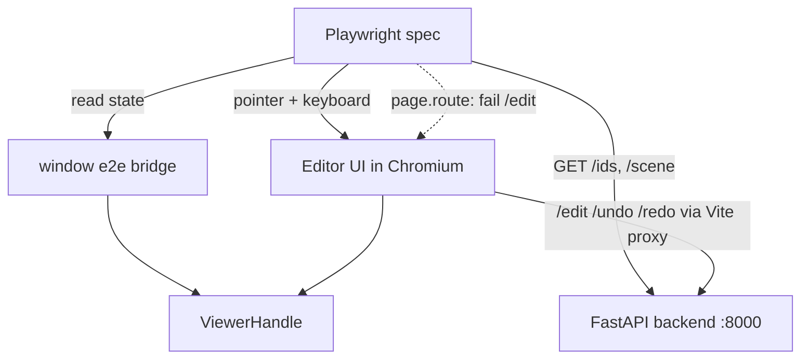

# Editor E2E Test Suite - Plan

## Goal Capsule

- **Objective:** An automated end-to-end browser test suite that proves every Part 1 editor feature — scene loading, shell/HUD, all five selection tools with modifiers, edit actions with unified history and stable-ID integrity, fly navigation and the move pad — against the real frontend and real backend, with no model key required.
- **Authority:** This plan; the manual QA script (`docs/plans/2026-07-06-001-test-manual-qa-editor-rework-plan.md`) Part 1 defines the feature coverage baseline; the rework plan (`docs/plans/2026-07-05-001-feat-editor-first-rework-plan.md`) defines the behaviors under test.
- **Stop conditions:** If U1's headless WebGL smoke test cannot render SparkJS splats under any Chromium configuration, stop and surface it — the fallback (headed-only suite) is a scope decision the owner must make, not an implementer call.
- **Execution profile:** Frontend TypeScript work plus one small backend-free harness; agent features are never exercised, so the backend runs with its stub agent runner.

---

## Product Contract

### Summary

Add a Playwright end-to-end suite that drives the editor in a real headless browser against the running FastAPI backend, loading the messy sphere demo through the UI and asserting through app state and backend truth (splat counts, selection counts, alive-ID sets) rather than pixels. The app gains a small, test-gated bridge exposing the existing viewer handle so tests can set deterministic camera poses and read scene state.

### Problem Frame

The editor-first rework shipped with green unit tests (121 pytest, 54 vitest) but zero automated coverage of the integrated system: a browser rendering real splats, pointer strokes resolving to splat IDs, edits round-tripping the backend, undo restoring both sides of the shared ID space. The one open Definition-of-Done item is a manual verification session; the manual QA script covers it once, but nothing prevents regressions afterward. The highest-risk behaviors — ID-map integrity across undo, failed-edit recovery, frontend/backend history convergence — live exactly at the seams unit tests can't reach. The institutional learning on this repo (`docs/solutions/architecture-patterns/backend-frontend-coordinate-and-edit-guards.md`) is explicit that seam bugs are invisible to isolated-layer tests.

### Requirements

**Harness**

- R1. One command runs the full e2e suite headlessly: it starts (or reuses) the Vite dev server and the backend, runs every spec, and exits nonzero on any failure. No model API key is needed.
- R2. Tests run in a real Chromium with working WebGL rendering of SparkJS splats, using the messy sphere demo (`public/demos/messy.ply`, 1200 splats) as the primary fixture loaded through the UI's own demo picker path.

**Coverage — every Part 1 feature**

- R3. Scene loading and editor shell: empty state, demo load, file import, HUD splat count reflecting the loaded scene and updating after edits, editor tool rail and selection UI present in Clean stage and absent in Understand stage.
- R4. All five selection tools and their shared grammar: brush (including `[`/`]` resize), lasso, polygon (≥3 vertices, snap-to-first and double-click close), sphere, box; Alt removes from selection; Escape cancels in-progress input; invert and clear; camera controls locked while a tool is active.
- R5. Edit actions and unified history: delete and keep-only apply locally and land in the backend history; after every destructive edit the frontend's live-ID set equals the backend's alive-ID set; undo restores both sides; a selection made after an undo deletes exactly the intended splats; interleaved edits undo in LIFO order; redo replays through the backend reload path; a backend-rejected edit restores the authoritative scene and shows the status toast.
- R6. Fly navigation and move pad: orbit/fly toggle, WASD/QE keys move the camera in fly mode, pad buttons drive the same motion, pad buttons light up for keyboard input, toggling back to orbit preserves a sane camera target.

**Testability**

- R7. The app exposes a test bridge (viewer handle, scene ID, UI state) only when explicitly enabled for testing; production and normal dev behavior are unchanged.
- R8. Assertions go through app state and backend endpoints, never screenshot or pixel comparison.

### Acceptance Examples

- AE1. **Covers R5.** Given splats were deleted and then undone, when a new region is selected and deleted, then exactly the newly selected splats disappear and the backend alive-ID set confirms it (the ID-map-restore-on-undo regression).
- AE2. **Covers R5.** Given the backend rejects an edit request, when the user deletes a selection, then the viewer reloads the backend's authoritative scene, the status toast appears, and frontend/backend counts match again.
- AE3. **Covers R6.** Given fly mode is active, when the W key is held, then the camera position changes and the pad's forward button shows as active.

### Scope Boundaries

- **In scope:** Part 1 of the manual QA script — the editor surface with no agent involvement.
- **Deferred to follow-up work:** agent-flow e2e (pause/takeover, stage-gated runs, skill pills — Part 2; needs a scripted-provider backend mode first); CI workflow wiring (repo has no CI today; the suite is a local command until CI exists); visual/pixel regression testing; performance testing on large scenes (`train.ply` at 668K splats — the O(N) selection optimization is itself deferred); view-only formats (`.splat`/`.spz`/`.ksplat` — no such demo asset is bundled).

---

## Planning Contract

### Key Technical Decisions

- KTD1. **Playwright over Vitest browser mode.** The suite needs multi-layer flows (UI event → WebGL render → backend HTTP → reload), web-server orchestration, route interception for failure injection, and real keyboard/pointer semantics (Alt-drag, Escape, key-hold). Playwright owns all of these natively; Vitest browser mode is component-scoped and has no route interception. New dev dependency, confirmed with owner at scoping.
- KTD2. **A gated window test bridge, not DOM-scraping.** `ViewerHandle` (`src/types/viewer.ts`) already exposes everything tests need: `getSplatCount`, `getSelectionCount`, `getLiveIds`, `setView`/`setCameraPose`, `getNavigationMode`, `getCameraPose`, `isLoaded`. A small module installs the handle plus scene ID and UI state on `window` only when an explicit e2e flag is present (URL query parameter); without the flag the bridge code is inert. This gives deterministic camera setup and precise assertions without exposing internals in production.
- KTD3. **Backend truth as the oracle.** The core invariant of the rework is one shared ID space (KTD2/KTD3 of the rework plan). Every destructive-edit spec asserts set-equality between the bridge's `getLiveIds()` and `GET /ids?scene_id=` — not just counts. Pixel assertions are banned (R8): headless WebGL output varies by GL backend and would make the suite flaky by construction.
- KTD4. **Playwright `webServer` starts both processes.** Vite dev server (which already proxies `/api`-style routes and `/ws` to `:8000` and sets the COOP/COEP headers SparkJS needs) plus `uvicorn backend.server:app`. Backend scene state is in-memory and per-upload, so each test loading its own demo gets an isolated scene ID — no cross-test state bleed even in one backend process.
- KTD5. **Failure paths via route interception, not process-killing.** AE2's backend-rejection path is driven by `page.route` aborting/failing the edit request — deterministic and per-test, where killing uvicorn would poison sibling tests.
- KTD6. **Selection strokes target the viewport center on a known fixture.** The messy sphere is centered; specs set an exact camera pose through the bridge (animation off) before any stroke, so screen-space gestures land on predictable geometry. Assertions stay range-based (selection count > 0, subset relations, exact ID-set equality after edits) rather than exact-count-of-a-stroke, which would be resolution-coupled.

### High-Level Technical Design

Specs act on the app the way a user does (pointer, keyboard, buttons) and assert through two read paths: the bridge (frontend truth) and backend HTTP (authoritative truth). The one manipulation shortcut allowed through the bridge is camera setup — everything under test is driven through the real UI.

### Assumptions

- Headless Chromium renders SparkJS/WebGL2 via its software GL backend (SwiftShader/ANGLE). Well-supported in current Playwright but unverified in this repo — U1 exists to prove it before anything else is built, and the Goal Capsule's stop condition owns the failure case.
- The demo picker fetch-and-upload path (`src/demos.ts` → `handleLoadDemo` in `src/App.tsx`) is a faithful equivalent of drag-drop loading; drag-drop itself is exercised once via the import file-input instead of synthetic DataTransfer events.
- 1200-splat scenes render and select fast enough that default Playwright timeouts hold; no perf tuning is in scope.

---

## Implementation Units

### U1. Playwright harness + WebGL smoke test

- **Goal:** Prove the whole approach is viable: Playwright installed, both servers auto-started, and a real splat scene renders headlessly.
- **Requirements:** R1, R2.
- **Dependencies:** none — this gates everything.
- **Files:** `playwright.config.ts`, `e2e/smoke.spec.ts`, `package.json` (add `@playwright/test`, `test:e2e` script), `.gitignore` (Playwright artifacts).
- **Approach:** Config uses the `webServer` array to launch `npm run dev` and `uvicorn backend.server:app --port 8000` with health-check URLs and `reuseExistingServer` for local iteration. Chromium-only project; launch args include the software-GL fallback if default headless WebGL fails. Specs live in `e2e/`, excluded from Vitest and from `tsc -b` app builds.
- **Test scenarios:**
  - Happy path: app loads at the dev URL, empty state is visible, a WebGL2 context is obtainable in the page.
  - Covers R2: clicking the Messy sphere demo leads to a rendered scene — poll until the app reports 1200 splats loaded (bridge lands in U2; until then the HUD text or a temporary window check is acceptable and is replaced in U2).
  - Failure visibility: backend not reachable → the webServer health check fails the run with a clear message (verify by documentation/manual check, not a committed spec).
- **Verification:** `npm run test:e2e` passes headlessly on the dev machine; `npm run build`, `npm run lint`, `npm test` all still green.

### U2. Test bridge + stable test hooks in the app

- **Goal:** Give specs deterministic setup and precise reads without changing production behavior.
- **Requirements:** R7; enables R3–R6 assertions.
- **Dependencies:** U1.
- **Files:** `src/test/e2eBridge.ts` (new), `src/App.tsx` (install bridge, pass scene ID + UI state), `src/ui/MovePad.tsx` (active-state data attribute per direction key), `src/ui/NarrationBar.tsx` (raw splat-count data attribute, bypassing the animated display), `src/test/e2eBridge.test.ts`.
- **Approach:** Bridge installs on `window` only when the e2e query flag is present. Exposes: the `ViewerHandle` (camera set/get, counts, `getLiveIds`, `isLoaded`, navigation mode), current scene ID, and UI state (stage, selection count, transient status text). Read-mostly by convention: specs may use camera setters and view presets for setup, nothing else. The MovePad/NarrationBar data attributes exist because pad lighting and HUD count are user-visible claims (R3, R6) that should be asserted on the DOM, not only through the bridge.
- **Patterns to follow:** gating and naming consistent with existing `import.meta.env` usage in the frontend; data attributes rather than test IDs on elements that already have semantic `title`/`aria-label` selectors.
- **Test scenarios:**
  - Unit (Vitest): bridge does not install without the flag; installs with it; exposes the expected keys.
  - E2E: with the flag, bridge reports `isLoaded` true and splat count 1200 after demo load; scene ID matches a backend scene that `GET /ids` answers for.
- **Verification:** production build output contains no active bridge (flag absent → no window global); all gates green.

### U3. Scene loading + shell/HUD specs

- **Goal:** Lock in R3 — the load paths and the stage-gated editor shell.
- **Requirements:** R3; QA script T1.
- **Dependencies:** U2.
- **Files:** `e2e/shell.spec.ts`, `e2e/fixtures.ts` (shared helpers: load demo, wait for scene, bridge accessors).
- **Test scenarios:**
  - Empty state shows load affordances; no toolbar, pad, or HUD scene data before a scene exists.
  - Demo load: Messy sphere → HUD count reads 1200; Clean sphere → 1000.
  - Import path: the hidden file input receives `examples/messy.ply` via `setInputFiles` → scene loads, backend registers it (bridge scene ID non-null).
  - Stage gating: switch to Understand → tool rail and selection overlay gone, active selection cleared; switch back to Clean → editing UI returns.
  - HUD updates: after a delete (helper from U4/U5 or a minimal brush stroke), HUD count drops by the deleted amount.
  - Load error path: importing a corrupt file (small invalid fixture) surfaces the load-failure message and returns to the empty state.
- **Verification:** specs pass headlessly and are independent (each starts from a fresh page).

### U4. Selection tool specs

- **Goal:** Lock in R4 — every tool, every modifier, the full SuperSplat grammar.
- **Requirements:** R4; QA script T2; AE-adjacent groundwork for AE1.
- **Dependencies:** U2, U3 (fixtures).
- **Files:** `e2e/selection.spec.ts`, `e2e/fixtures.ts` (stroke helpers: paint, lasso path, polygon clicks, volume drag — all relative to viewport center).
- **Approach:** Every spec first sets a fixed camera pose through the bridge (animation off), then drives real pointer/keyboard events on the overlay. Counts are read from the bridge and cross-checked against the toolbar's selection-count UI where visible.
- **Test scenarios:**
  - Brush: paint across center → selection count > 0; `]` several times then a single dot selects more than a single small-brush dot at the same spot (resize is observable behaviorally).
  - Lasso: closed freehand loop around center → nonzero selection; selection is a subset of live IDs.
  - Polygon: three clicks + click within snap range of the first vertex → commits; separate case commits via double-click; two clicks then attempted close → no selection.
  - Sphere and box: three-state drag at center → nonzero selection for each.
  - Alt-remove: select a region, Alt-paint a sub-region → count strictly decreases and removed IDs are gone from `getSelectionIds` (bridge).
  - Escape: mid-lasso Escape → selection count unchanged from before the gesture.
  - Invert: selection count becomes total live minus previous count; clear → 0.
  - Camera lock: with brush active, a canvas drag leaves the camera pose unchanged (bridge pose equality) while selection changes; with no tool active, the same drag changes the pose.
  - Empty-selection guard: delete/keep/clear buttons disabled at count 0.
- **Verification:** all specs pass headlessly; no spec asserts an exact stroke-hit count (resolution-coupled).

### U5. Edit actions + unified history / stable-ID specs

- **Goal:** Lock in R5 — the highest-risk seam: one ID space, one logical history, recovery on failure.
- **Requirements:** R5; AE1, AE2; QA script T4.
- **Dependencies:** U4 (stroke helpers).
- **Files:** `e2e/history.spec.ts`, `e2e/fixtures.ts` (extend with delete/keep/undo/redo and oracle helpers).
- **Approach:** Every destructive step ends with the oracle check: bridge `getLiveIds()` set-equals `GET /ids?scene_id=`. Failure injection uses `page.route` on the edit endpoint (KTD5).
- **Test scenarios:**
  - Delete: select + Delete → both sides drop by the selection size; deleted IDs absent from both sets.
  - Keep-only: select + Keep → both sides equal exactly the prior selection ID set.
  - Undo: after delete, Undo → both sides back to the full 1200; camera pose unchanged by undo (instant local path).
  - Covers AE1: delete region A → undo → select region B → delete → backend alive set is missing exactly B's IDs; nothing from A is unexpectedly gone.
  - LIFO: delete A, delete B, undo, undo → after first undo only B restored, after second both — verified against backend IDs at each step.
  - Redo: after undo, Redo → the edit reapplies via the backend reload path; both sides match; HUD count follows.
  - Covers AE2: route-fail the edit call, delete a selection → status toast appears, scene reloads, frontend count returns to backend truth; a subsequent unrouted delete works normally.
  - Idempotent boundary: undo with empty history is a no-op (no crash, counts stable).
- **Verification:** specs pass headlessly and repeatably (run twice in a row); this unit is the suite's canary — flakiness here means a determinism bug in the helpers, not an acceptable retry case.

### U6. Fly navigation + move pad specs

- **Goal:** Lock in R6 — mode toggle, keys, pad, pad lighting, target preservation.
- **Requirements:** R6; AE3; QA script T3.
- **Dependencies:** U2, U3.
- **Files:** `e2e/navigation.spec.ts`.
- **Test scenarios:**
  - Toggle: top-bar nav button flips bridge `getNavigationMode` orbit↔fly.
  - Covers AE3: in fly mode, hold W (keyboard down, poll, up) → camera position changes along its forward axis; the pad's forward button carries the active data attribute while held and clears on release.
  - Each of A/S/D/Q/E produces a position delta on the expected axis sign; no key → no drift.
  - Pad buttons: pointer-down on a pad button moves the camera and lights that button; pointer-up stops motion.
  - Orbit-return regression: fly somewhere, toggle to orbit → `getCameraPose().target` is finite and orbit drag still works (the FlyControls-target crash from the doc review).
  - Keys ignored in orbit mode: W in orbit mode → no camera translation.
- **Verification:** specs pass headlessly; camera assertions use tolerances, not exact floats.

### U7. Suite documentation + gate wiring

- **Goal:** Make the suite a first-class repo gate developers actually run.
- **Requirements:** R1.
- **Dependencies:** U1–U6.
- **Files:** `CLAUDE.md` (Build/Lint/Test commands section), `README.md` (short testing note), `e2e/README.md` (optional: flag, servers, how to run one spec / headed mode).
- **Approach:** Document `npm run test:e2e`, the Playwright browser install step, and that the backend needs its Python deps but no model key. Update the manual QA script (`docs/plans/2026-07-06-001-test-manual-qa-editor-rework-plan.md`) Part 1 header to note which checklist items are now automated and which remain manual-only (visual look-and-feel judgments).
- **Test scenarios:** Test expectation: none — documentation unit; the gate is that the documented command works from a clean checkout.
- **Verification:** following the docs verbatim on a fresh clone reaches a green `npm run test:e2e`.

---

## Verification Contract

| Gate | Command | Applies to |
|---|---|---|
| E2E suite (new) | `npm run test:e2e` | U1–U6; the plan's primary gate |
| Frontend units | `npm test` | U2 bridge unit tests; no regressions elsewhere |
| Type-check + build | `npm run build` | all frontend-touching units |
| Lint | `npm run lint` | all frontend-touching units |
| Backend units | `cd backend && pytest` | unchanged — this plan adds no backend code; must stay green |

Quality bar: the e2e suite passes headlessly twice consecutively (determinism check) on the dev machine with no test retries configured for U5.

---

## Definition of Done

- `npm run test:e2e` runs every spec (shell, selection, history, navigation) headlessly with one command and exits green, no model key set.
- Every Part 1 feature from the manual QA script has at least one automated spec; the QA script is annotated with what remains manual-only.
- The frontend/backend ID-space equality oracle runs after every destructive-edit step in the history specs, and AE1's undo-then-select regression is covered.
- The test bridge and data attributes are inert without the e2e flag; `npm run build`, `npm run lint`, `npm test`, and `pytest` are all green.
- No dead-end harness experiments remain in the diff (e.g., abandoned GL flag combinations left in config).
