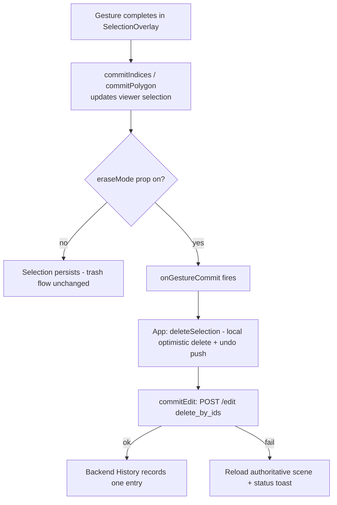

# Editor Direct-Manipulation Tweaks - Plan

## Goal Capsule

- **Objective:** Make manual splat editing feel direct and confirmable: erase-as-you-select, an explicit pointer/navigation mode with drag-to-rotate, an on-screen rotate control, and an edit-aware export button.
- **Product authority:** Product Contract below (confirmed in brainstorm dialogue). Planning Contract governs implementation choices.
- **Execution profile:** Frontend-only change set (`src/`); the backend is consumed, not modified. Standard depth, four implementation units, no phasing.
- **Stop conditions:** Surface a blocker instead of guessing if a unit requires backend changes, contract (`src/contracts.ts` / `backend/contracts/`) changes, or conflicts with the agent pause/stage-gating behavior.

---

## Product Contract

### Summary

Four additions to the editor chrome: an erase mode that deletes splats the moment a selection gesture completes, a pointer/navigation button on the tool rail that puts selection tools down and restores drag-to-rotate, an on-screen rotate control alongside the existing move pad, and a top-bar edit-aware Export button that downloads the current edited scene as a `.ply`.

### Problem Frame

While a selection tool is active, dragging is captured by the tool, so there is no way to turn the camera — and no visible control to exit the tool other than re-clicking its rail icon. Deleting also always requires a second trip to the trash button after every selection. Finally, nothing in the UI shows that edits actually changed the backend scene, and there is no way to get the edited file out; this made editing feel broken even when it worked (the source `.ply` on disk is never modified — edits live in the backend's scene, served on demand).

### Key Decisions

- **Erase mode is a toggle, not a replacement.** The select-then-trash flow stays fully intact; erase mode is an opt-in rail toggle that makes selection gestures commit a delete immediately.
- **Erase mode covers all five selection tools.** Brush, lasso, polygon, sphere, and box all auto-delete on gesture completion when the toggle is on — not just brush/lasso.
- **Direction changes work by drag and by button.** Pointer mode restores SuperSplat-style drag-to-rotate, and a dedicated on-screen rotate control provides the same ability without dragging.
- **The export button is edit-aware.** Rather than a plain download button, it surfaces dirty state (splats removed since load), so it doubles as confirmation that edits took effect — directly answering the "why doesn't the .ply get edited" confusion.
- **Download serves the backend's live scene; the source file is never modified in place.** The downloaded `.ply` is the edited copy; the file the user loaded stays untouched on disk.

### Requirements

**Erase mode**

- R1. The tool rail has an erase-mode toggle; when on, completing any selection gesture (brush stroke, lasso close, polygon close, sphere commit, box commit) immediately deletes the selected splats with no trash click.
- R2. Each erase gesture records as one edit in history — a single Undo restores exactly that gesture's splats — and flows through the same backend edit path as manual deletes.
- R3. With erase mode off, all current behavior (select, trash, keep, invert, clear) is unchanged.

**Pointer / navigation mode**

- R4. The tool rail has a pointer/navigation button; activating it deactivates any selection tool and is visibly highlighted as the active mode.
- R5. With pointer mode active, dragging in the viewport rotates the view (orbit or fly-look per the current navigation mode), matching SuperSplat's drag-to-orbit feel.
- R6. Existing exits (Escape, re-clicking the active tool) continue to work and land in pointer mode.

**Rotate control**

- R7. An on-screen rotate/turn control sits alongside the existing move pad and turns the camera without dragging; it works in both orbit and fly modes.
- R8. The rotate control follows the move pad's convention of lighting up for any input source, including agent-driven camera moves.

**Edit-aware export**

- R9. The top bar has an Export/Download button; clicking it downloads the current backend scene as a `.ply` (the edited alive set).
- R10. The button stays quiet until the scene diverges from the loaded file, then shows a badge with the number of splats removed; hover shows a short edit summary.
- R11. The button is disabled for scenes with no backend registration (view-only formats that never uploaded).

### Acceptance Examples

- AE1. **Covers R1, R2.** Given erase mode is on, when the user completes a brush stroke over 500 splats, then those splats disappear immediately without a trash click, and one Undo restores all 500.
- AE2. **Covers R9, R10.** Given a freshly loaded scene, the export button shows no badge; when the user deletes 3,412 splats and clicks Export, the badge reads the removed count and the downloaded `.ply` omits those splats while the file on disk is unchanged.
- AE3. **Covers R4, R5.** Given the lasso tool is active, when the user clicks the pointer button and drags in the viewport, then no selection is made and the camera rotates.

### Scope Boundaries

- No persistent session save or scene versioning — export is the only way edits leave the app, unchanged from today.
- No export formats beyond `.ply`, and no "download original" or "revert all" menu — the original file is already on the user's disk, and Undo covers reverts.
- No changes to the agent's tool surface or the Understand-stage gating; these are manual-editing UX additions only.

### Deferred to Follow-Up Work

- Cached-centers/stride optimization for the O(N) selection loops (pre-existing known issue; erase mode adds no new per-gesture cost beyond the existing select-then-delete path).

### Dependencies / Assumptions

- The backend already serves the edited alive set at `GET /scene/{id}.ply` (`backend/api/routes.py`); export is UI wiring, not new export machinery.
- Manual edits already commit through the backend edit path with history (`src/App.tsx` `commitEdit`); erase mode reuses this path.
- Selection tools and the rail live in `src/ui/EditorToolbar.tsx`; the move pad convention referenced by R8 is the existing `src/ui/MovePad.tsx` behavior.

---

## Planning Contract

**Product Contract preservation:** unchanged from the requirements-only artifact.

### Key Technical Decisions

- KTD1. **Pointer mode is the existing tool-null state made explicit — no new drag machinery.** `SelectionOverlay` returns `null` when no tool is active, so the renderer canvas already receives drags (OrbitControls in orbit mode, `onLookMove` drag-to-look in fly mode). The pointer button and Escape exit just set `activeTool` to `null`; R5 is satisfied by unmounting the overlay, not by new camera code.
- KTD2. **Erase mode hooks the gesture-commit seam inside `SelectionOverlay` via props.** All five tools funnel gesture completion through `commitIndices` / `commitPolygon`. An `eraseMode` prop makes the overlay fire an `onGestureCommit` callback after each commit (and forces the Alt `remove` flag off — nothing persists to remove from); `App` responds by running the existing delete path. Reusing `commitEdit` keeps one gesture = one local undo step = one backend `History` entry with zero new backend surface.
- KTD3. **Erase-mode selection is transient.** Enabling erase mode clears any existing selection; each gesture selects, deletes, and leaves the selection empty. This is what makes "one Undo restores exactly that gesture" (R2) unambiguous.
- KTD4. **The rotate pad drives a per-frame rotation-direction set in `SceneManager`, mirroring `activeDirections`.** A held button adds a rotation direction consumed each frame — routed to `OrbitControls.rotateLeft/rotateUp` in orbit mode and the yaw/pitch look math in fly mode. Agent camera rotation (`SceneManager.orbit()`, already used by `move_camera`) pulses the same state, so the pad highlights for any input source (R8) exactly as the move pad does.
- KTD5. **Escape is two-step.** With a gesture in progress, Escape cancels it and keeps the tool (current behavior); with nothing in progress, Escape exits to pointer mode. Implemented in the overlay's existing keydown handler plus a new exit callback.
- KTD6. **Dirty state derives from the alive-count delta, not accumulated edit ops.** `removedCount = countAtLoad − currentAliveCount`, recomputed from viewer state on every edit/undo/redo/authoritative-reload. Deriving (rather than summing operations) makes undo/redo and backend-reload correctness free.
- KTD7. **Download is a plain anchor to the existing endpoint.** Export triggers a download of `scenePlyUrl(sceneId)` (`src/backend/client.ts`); the backend's chunked `FileResponse` of the alive set does the rest. No new API.

### High-Level Technical Design

Erase-mode data flow — the one multi-stage path this plan adds (everything downstream of "delete selection" is today's code):

### Assumptions

- Vitest covers pure logic (`src/viewer/*.test.ts` pattern); there is no DOM/component test harness, so UI states are verified by type-checked build + manual pass per the Verification Contract.
- Rotation activity from the agent path can be signaled from `SceneManager.orbit()` without touching `frontend/src/agent/` executors (they already call the viewer handle).

---

## Implementation Units

### U1. Pointer/navigation mode on the tool rail

- **Goal:** An explicit pointer mode that puts selection tools down and restores drag rotation.
- **Requirements:** R4, R5, R6 (AE3).
- **Dependencies:** none.
- **Files:** `src/ui/EditorToolbar.tsx`, `src/viewer/SelectionOverlay.tsx`, `src/App.tsx`.
- **Approach:** Add a pointer button (e.g. lucide `MousePointer2`) above the tool group in the rail, rendered active when `activeTool === null`; clicking it calls `onToolChange(null)`. Per KTD5, extend the overlay's Escape handler: if an interaction is in progress, cancel it (existing `resetInteraction`); otherwise invoke a new `onExitTool` prop that `App` wires to `setActiveTool(null)`. No camera changes (KTD1).
- **Patterns to follow:** `RailButton` active/disabled styling in `src/ui/EditorToolbar.tsx`; overlay keyboard handling in `src/viewer/SelectionOverlay.tsx`.
- **Test scenarios:**
  - Escape during an in-progress lasso cancels the path but keeps the lasso tool active (no `onExitTool` call).
  - Escape with no gesture in progress calls `onExitTool` exactly once.
  - Covers AE3 (manual): with lasso active, click pointer button, drag in viewport — no selection is made and the camera rotates in both orbit and fly modes.
  - Pointer button renders active when no tool is selected and inactive once any tool is picked.
- **Verification:** `npm run build` and `npx vitest run` pass; AE3 manual check in the running app.

### U2. Erase mode

- **Goal:** Completing any selection gesture immediately deletes its splats when erase mode is on.
- **Requirements:** R1, R2, R3 (AE1).
- **Dependencies:** U1 (shared files — land the rail/overlay prop changes first).
- **Files:** `src/ui/EditorToolbar.tsx`, `src/viewer/SelectionOverlay.tsx`, `src/App.tsx`.
- **Approach:** Erase toggle in the rail (e.g. lucide `Eraser`) with distinct active styling, state owned by `App`. Pass `eraseMode` into `SelectionOverlay`; per KTD2 the overlay forces `remove=false` while erasing and fires `onGestureCommit` after each of the five commit points (brush pointerup, lasso pointerup, polygon close via snap/double-click, sphere/box pointerup). `App` handles `onGestureCommit` by invoking the existing `handleDeleteSelection`. Per KTD3, enabling the toggle clears the current selection.
- **Patterns to follow:** `handleDeleteSelection`/`commitEdit` in `src/App.tsx` — do not add a second delete path; optimistic-apply-then-record convention from `docs/solutions/architecture-patterns/backend-frontend-coordinate-and-edit-guards.md` context.
- **Test scenarios:**
  - Covers AE1: in erase mode, a brush-stroke commit triggers exactly one delete with the stroke's ids; one undo restores them.
  - Each of the five tools' commit points fires `onGestureCommit` when `eraseMode` is set.
  - A gesture selecting zero splats commits no edit (existing `ids.length === 0` guard holds).
  - Alt-modified gestures behave as plain erases while erase mode is on (remove flag forced off).
  - Enabling erase mode clears a pre-existing selection; disabling it restores normal select-then-trash behavior (R3).
- **Verification:** `npx vitest run` covers the overlay commit/callback logic; AE1 manual check against a backend-registered scene confirms one backend history entry per gesture (single undo restores).

### U3. Rotate control pad

- **Goal:** Button-based camera rotation next to the move pad, lighting up for any input source.
- **Requirements:** R7, R8.
- **Dependencies:** none.
- **Files:** `src/ui/RotatePad.tsx` (new), `src/viewer/SceneManager.ts`, `src/viewer/flyController.ts`, `src/types/viewer.ts`, `src/App.tsx`, plus test file `src/viewer/flyController.test.ts` (extend).
- **Approach:** Arrow-style pad mirroring `MovePad` (left/right = yaw, up/down = pitch), positioned beside it. Per KTD4, add a rotation-direction set to `SceneManager` consumed in the per-frame update: orbit mode routes through `OrbitControls.rotateLeft/rotateUp` (same calls as `orbit()`); fly mode routes through the yaw/pitch math factored out of `onLookMove` into a pure helper in `src/viewer/flyController.ts`. Expose set/get on the viewer handle; `SceneManager.orbit()` (the agent path) pulses the matching direction briefly so the pad highlights for agent moves (R8). Works in both nav modes without forcing a mode switch (unlike move input, which implies fly).
- **Technical design (directional):** `composeLook(dx, dy, sensitivity) -> yaw/pitch deltas` as a pure function beside `composeMove`, unit-tested the same way.
- **Patterns to follow:** `src/ui/MovePad.tsx` pointer-capture button grid and `activeDirections` highlight-as-view-of-shared-state; `composeMove` purity convention in `src/viewer/flyController.ts`.
- **Test scenarios:**
  - Pure helper: yaw-left/right and pitch-up/down produce opposite-sign deltas; zero directions produce zero delta; deltas scale with dt/sensitivity.
  - Holding a rotate direction rotates the camera each frame in fly mode and in orbit mode (state-level assertion on camera pose change).
  - Pointer up / pointer leave clears the direction (no stuck rotation).
  - `SceneManager.orbit()` marks the matching rotation direction active and clears it after the pulse window.
- **Verification:** `npx vitest run` passes with the new helper tests; manual check that the pad lights during an agent `move_camera` rotation.

### U4. Edit-aware export button

- **Goal:** A top-bar Export button that downloads the edited `.ply` and shows a splats-removed badge once the scene diverges.
- **Requirements:** R9, R10, R11 (AE2).
- **Dependencies:** none.
- **Files:** `src/ui/TopBar.tsx`, `src/App.tsx`.
- **Approach:** Per KTD6, `App` records the alive count at scene registration and derives `removedCount` from the viewer's current count on every edit, undo, redo, and authoritative reload. `TopBar` gains an Export button (rename the existing Import icon usage if needed to avoid two `Download` icons) with: disabled state when no backend `sceneId` (R11), quiet state at zero delta, count badge + hover summary title once `removedCount > 0` (R10). Click builds an anchor to `scenePlyUrl(sceneId)` with the `download` attribute (KTD7).
- **Patterns to follow:** `topbar-btn` styling and prop wiring in `src/ui/TopBar.tsx`; `scenePlyUrl` / `getAliveIds` usage in `src/App.tsx` and `src/backend/client.ts`.
- **Test scenarios:**
  - Covers AE2: badge hidden at load; after deleting N splats the badge shows N; the download URL targets the scene's `.ply` endpoint.
  - Undo back to the baseline count hides the badge again.
  - View-only scene (no backend registration) renders the button disabled.
  - After a rejected backend edit triggers the authoritative reload, the badge reflects the reloaded alive count, not the optimistic one.
- **Verification:** `npm run build` and `npx vitest run` pass; AE2 manual check — downloaded file loads back with the edited count while the original file on disk is unchanged.

---

## Verification Contract

| Gate | Command | Applies to |
|---|---|---|
| Type-check + production build | `npm run build` | all units |
| Lint | `npm run lint` | all units |
| Frontend unit tests | `npx vitest run` | U1, U2, U3, U4 |
| Backend tests | not required | backend is not modified; if any backend file changes, that violates the Goal Capsule stop condition |

Manual acceptance pass (single session in `npm run dev` against a backend-registered scene): AE1, AE2, AE3, plus the R8 agent-rotation highlight.

## Definition of Done

- All four units implemented with their test scenarios passing under `npx vitest run`; `npm run build` and `npm run lint` clean.
- AE1–AE3 demonstrated in the running app; erase gestures produce one backend history entry each (single undo restores a full gesture).
- Select-then-trash, keep, invert, clear, and both nav modes behave exactly as before with erase mode off (R3 regression check).
- No abandoned or experimental code left in the diff; no changes under `backend/`, `frontend/src/contracts.ts`, or `backend/contracts/`.
